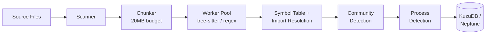

# Code Indexing

GitNexus indexes source code repositories into a **knowledge graph** of symbols (functions, classes, modules, data items) and their relationships (calls, imports, inheritance, data flow). This graph powers code intelligence features: semantic search, impact analysis, execution flow tracing, and natural-language queries via Cypher.

The indexing pipeline supports **14 languages** through two parsing strategies:
- **Tree-sitter** (13 languages) — AST-based extraction using language-specific queries
- **Regex-only** (COBOL) — single-pass state machine extraction with deep indexing for SQL, CICS, and data items

The result is a unified graph stored in **KuzuDB** (embedded, default) or **AWS Neptune** (managed, optional), with optional full-text search indexes and 384-dimensional semantic embeddings.

## Quick Start

```bash
# Index the current repository
gitnexus analyze

# Index with embeddings and verbose output
gitnexus analyze --embeddings --verbose

# Index a COBOL repository with extensionless files
GITNEXUS_COBOL_DIRS=s,c,wfproc gitnexus analyze /path/to/repo
```

## Pipeline Overview



See [Pipeline Architecture](pipeline-architecture.md) for the full stage-by-stage breakdown.

## Language Comparison Matrix

| Language | Parser | Extensions | Definitions | Calls | Imports | Heritage | Deep Indexing |
|----------|--------|------------|:-----------:|:-----:|:-------:|:--------:|:-------------:|
| [TypeScript](languages/typescript.md) | tree-sitter | `.ts` `.tsx` `.mts` `.cts` | Class, Interface, Function, Method | free, member, constructor | import, re-export | extends, implements | -- |
| [JavaScript](languages/javascript.md) | tree-sitter | `.js` `.jsx` `.mjs` `.cjs` | Class, Function, Method | free, member, constructor | import, re-export | extends | -- |
| [Python](languages/python.md) | tree-sitter | `.py` `.pyi` `.pyw` | Class, Function | free, attribute | import, from-import | extends (multiple) | -- |
| [Java](languages/java.md) | tree-sitter | `.java` | Class, Interface, Enum, Annotation, Method, Constructor | method, constructor | import | extends, implements | -- |
| [C](languages/c.md) | tree-sitter | `.c` `.h` | Function, Struct, Union, Enum, Typedef, Macro | free, field | #include | -- | -- |
| [C++](languages/cpp.md) | tree-sitter | `.cpp` `.cc` `.cxx` `.hpp` `.hh` `.hxx` `.h` | Class, Struct, Namespace, Enum, Typedef, Union, Macro, Function, Method, Template | free, field, qualified, template, constructor | #include | extends (with access) | -- |
| [C#](languages/csharp.md) | tree-sitter | `.cs` | Class, Interface, Struct, Enum, Record, Delegate, Namespace, Method, Function, Constructor, Property | invocation, member, constructor, target-typed new | using | extends (base_list) | -- |
| [Go](languages/go.md) | tree-sitter | `.go` | Function, Method, Struct, Interface | free, selector, composite literal | import | struct embedding | -- |
| [Rust](languages/rust.md) | tree-sitter | `.rs` | Function, Struct, Enum, Trait, Impl, Module, TypeAlias, Const, Static, Macro | free, field, scoped, generic, struct expr | use | trait impl (4 variants) | -- |
| [Kotlin](languages/kotlin.md) | tree-sitter | `.kt` `.kts` | Class, Interface, Function, Property, Enum, TypeAlias | direct, navigation, constructor, infix | import | delegation_specifier | -- |
| [PHP](languages/php.md) | tree-sitter | `.php` | Namespace, Class, Interface, Trait, Enum, Function, Method, Property | function, method, nullsafe, static, constructor | use | extends, implements, trait use | -- |
| [Ruby](languages/ruby.md) | tree-sitter | `.rb` `.rake` `.gemspec` | Module, Class, Method | call routing (require/include/attr_*) | require, require_relative | superclass, mixins | -- |
| [Swift](languages/swift.md) | tree-sitter | `.swift` | Class, Struct, Enum, Interface, TypeAlias, Function, Method, Constructor, Property | direct, navigation | import | inheritance, protocol conformance | -- |
| [COBOL](cobol/README.md) | regex | `.cbl` `.cob` `.cobol` + extensionless | Module, Function, Namespace, Record, Property, Const, CodeElement, Constructor | CALL, PERFORM | COPY | -- | SQL, CICS, Data Items, File Decl |

## Documentation Map

### Architecture

| Document | Description |
|----------|-------------|
| [Pipeline Architecture](pipeline-architecture.md) | Full pipeline flow from CLI to graph DB — all 9 phases with sequence diagrams |
| [Graph Schema](graph-schema.md) | All 27 node types, 17 relationship types, properties, and embedding table |
| [Worker Architecture](worker-architecture.md) | Worker pool, sub-batching, memory management, timeout handling, error recovery |
| [Configuration](configuration.md) | Environment variables, CLI options, tuning guide, database backend selection |

### Language Guides

| Language | Node Types | Lines |
|----------|-----------|-------|
| [TypeScript](languages/typescript.md) | Class, Interface, Function, Method | 173 |
| [JavaScript](languages/javascript.md) | Class, Function, Method | 174 |
| [Python](languages/python.md) | Class, Function | 191 |
| [Java](languages/java.md) | Class, Interface, Enum, Annotation, Method, Constructor | 241 |
| [C](languages/c.md) | Function, Struct, Union, Enum, Typedef, Macro | 287 |
| [C++](languages/cpp.md) | Class, Struct, Namespace, Enum, Typedef, Union, Macro, Function, Method, Template | 416 |
| [C#](languages/csharp.md) | Class, Interface, Struct, Enum, Record, Delegate, Namespace, Method, Function, Constructor, Property | 207 |
| [Go](languages/go.md) | Function, Method, Struct, Interface | 213 |
| [Rust](languages/rust.md) | Function, Struct, Enum, Trait, Impl, Module, TypeAlias, Const, Static, Macro | 289 |
| [Kotlin](languages/kotlin.md) | Class, Interface, Function, Property, Enum, TypeAlias | 209 |
| [PHP](languages/php.md) | Namespace, Class, Interface, Trait, Enum, Function, Method, Property | 219 |
| [Ruby](languages/ruby.md) | Module, Class, Method | 222 |
| [Swift](languages/swift.md) | Class, Struct, Enum, Interface, TypeAlias, Function, Method, Constructor, Property | 297 |

### COBOL Deep-Dive

| Document | Description |
|----------|-------------|
| [COBOL Overview](cobol/README.md) | Why regex-only, architecture, comparison with tree-sitter |
| [File Detection](cobol/file-detection.md) | Extensions, `GITNEXUS_COBOL_DIRS`, copybook classification |
| [COPY Expansion](cobol/copy-expansion.md) | Copybook inlining, REPLACING (LEADING/TRAILING/EXACT), cycle detection |
| [Regex Extraction](cobol/regex-extraction.md) | State machine, 20+ regex patterns, division/section tracking |
| [Deep Indexing](cobol/deep-indexing.md) | EXEC SQL, EXEC CICS, data items, file declarations, ENTRY points |
| [Graph Model](cobol/graph-model.md) | COBOL-specific node types, edge types, annotated examples |
| [Performance](cobol/performance.md) | EPAGHE benchmarks, tuning, known limitations, troubleshooting |

## Key Source Files

| File | Role |
|------|------|
| `gitnexus/src/cli/analyze.ts` | CLI entry point, DB loading, embeddings |
| `gitnexus/src/core/ingestion/pipeline.ts` | Pipeline orchestration |
| `gitnexus/src/core/ingestion/tree-sitter-queries.ts` | All tree-sitter extraction queries |
| `gitnexus/src/core/ingestion/workers/worker-pool.ts` | Worker pool implementation |
| `gitnexus/src/core/ingestion/workers/parse-worker.ts` | Worker thread parsing logic |
| `gitnexus/src/core/ingestion/cobol-preprocessor.ts` | COBOL regex extraction |
| `gitnexus/src/core/ingestion/cobol-copy-expander.ts` | COPY statement expansion |
| `gitnexus/src/core/kuzu/schema.ts` | KuzuDB schema definitions |
| `gitnexus/src/core/graph/types.ts` | Graph type definitions |
