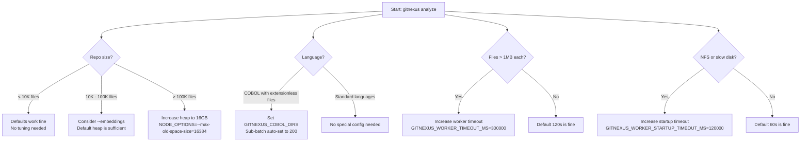
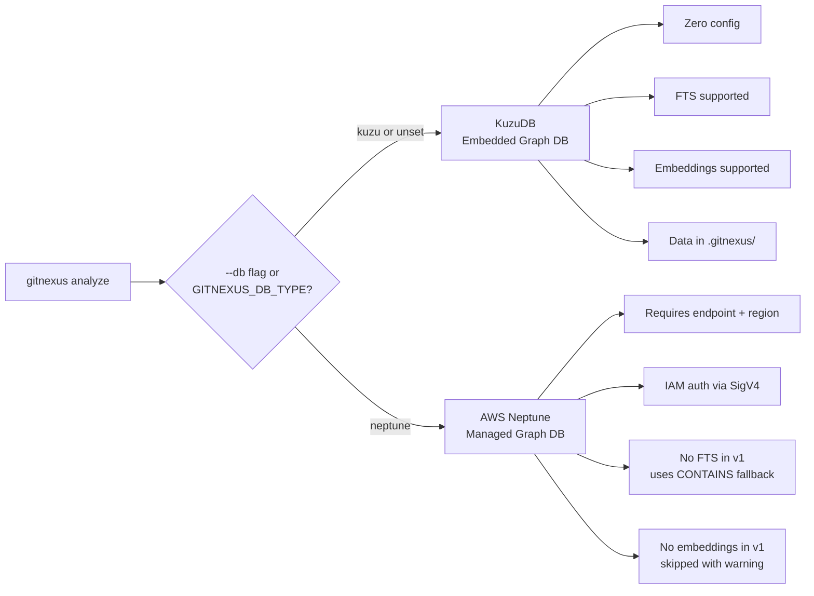

# Configuration Reference

This document covers all environment variables, CLI options, and tuning parameters for the GitNexus indexing pipeline.

**Source files:**

- [`gitnexus/src/core/ingestion/workers/worker-pool.ts`](/gitnexus/src/core/ingestion/workers/worker-pool.ts) -- timeout and pool-size constants
- [`gitnexus/src/core/ingestion/pipeline.ts`](/gitnexus/src/core/ingestion/pipeline.ts) -- chunk budget, COBOL sub-batch logic
- [`gitnexus/src/cli/analyze.ts`](/gitnexus/src/cli/analyze.ts) -- CLI option parsing, Neptune/embedding config resolution
- [`gitnexus/src/core/ingestion/utils.ts`](/gitnexus/src/core/ingestion/utils.ts) -- `GITNEXUS_COBOL_DIRS` language detection

---

## Environment Variables

| Variable | Type | Default | Description |
|----------|------|---------|-------------|
| `GITNEXUS_VERBOSE` | boolean | unset | Enable verbose logging. Shows chunk details, worker pool info, community/process stats, and per-file progress. |
| `GITNEXUS_COBOL_DIRS` | string | unset | Comma-separated directory names to treat extensionless files as COBOL (e.g., `s,c,wfproc`). Also triggers COBOL-mode optimizations: 200-file sub-batches and lazy tree-sitter loading in workers. |
| `GITNEXUS_DB_TYPE` | string | `kuzu` | Database backend: `kuzu` (embedded, default) or `neptune` (AWS managed). |
| `GITNEXUS_NEPTUNE_ENDPOINT` | string | -- | AWS Neptune cluster endpoint hostname (e.g., `cluster.us-east-1.neptune.amazonaws.com`). Required when `GITNEXUS_DB_TYPE=neptune`. |
| `GITNEXUS_NEPTUNE_REGION` | string | -- | AWS region for Neptune. Falls back to `AWS_REGION` if unset. Required when using Neptune. |
| `GITNEXUS_NEPTUNE_PORT` | string | `8182` | Neptune HTTPS port. |
| `GITNEXUS_WORKER_TIMEOUT_MS` | number | `120000` | Per sub-batch worker timeout in milliseconds. If a single sub-batch exceeds this, the worker is terminated and the pipeline falls back to sequential parsing. |
| `GITNEXUS_WORKER_STARTUP_TIMEOUT_MS` | number | `60000` | Time (ms) to wait for all workers to load tree-sitter grammars and signal readiness. Increase if native modules are slow to load (e.g., NFS-mounted node_modules). |
| `NODE_OPTIONS` | string | -- | Node.js runtime options. The pipeline auto-sets `--max-old-space-size=8192` if not already present by re-execing the process. |

---

## CLI Analyze Options

```
gitnexus analyze [path] [options]
```

| Option | Description |
|--------|-------------|
| `[path]` | Repository path to index. Defaults to the git root of the current working directory. |
| `--force` | Force re-index even if the current commit matches the last indexed commit. |
| `--embeddings` | Generate semantic embeddings (384-dim by default, ONNX local provider, capped at 50K nodes). |
| `--skills` | Generate AI skill files for detected code communities. |
| `--verbose` | Enable verbose output (sets `GITNEXUS_VERBOSE=1`). |
| `--db <type>` | Database backend: `kuzu` (default) or `neptune`. |
| `--neptune-endpoint <host>` | Neptune cluster endpoint hostname. |
| `--neptune-region <region>` | AWS region for Neptune. |
| `--neptune-port <port>` | Neptune port (default: `8182`). |
| `--embed-provider <type>` | Embedding provider: `local` (default), `ollama`, `openai`, `cohere`. |
| `--embed-model <name>` | Model name (default depends on provider). |
| `--embed-dims <number>` | Embedding dimensions (default: `384`). |
| `--embed-endpoint <url>` | Custom endpoint for embedding provider. |
| `--embed-api-key <key>` | API key for embedding provider. |

### Examples

Index the current repository:

```bash
gitnexus analyze
```

Force re-index with embeddings:

```bash
gitnexus analyze --force --embeddings
```

Index a COBOL repository with extensionless files:

```bash
GITNEXUS_COBOL_DIRS=s,c,wfproc node --max-old-space-size=8192 \
  gitnexus analyze /path/to/cobol-repo --force --verbose
```

Index to AWS Neptune:

```bash
gitnexus analyze --db neptune \
  --neptune-endpoint mycluster.us-east-1.neptune.amazonaws.com \
  --neptune-region us-east-1
```

---

## Tuning Guide

### Configuration Decision Flow



### Heap Size

The pipeline auto-detects if the heap is below 8GB and re-execs the process with `--max-old-space-size=8192`. For very large repos (>100K files), override this:

```bash
NODE_OPTIONS="--max-old-space-size=16384" gitnexus analyze
```

The 8GB default handles repos up to approximately 100K parseable files. At 20MB per chunk, a 200MB codebase produces approximately 10 chunks. Each chunk's peak memory (source + ASTs + extracted records + serialization) is 200--400MB, and chunks are processed sequentially with GC between them.

### Worker Count

Auto-detected: `min(8, max(1, os.cpus().length - 1))`. There is no manual override currently. The cap at 8 prevents diminishing returns from context switching and memory pressure on machines with many cores.

### COBOL Sub-Batch Size

Automatically set to 200 (vs. default 1500) when `GITNEXUS_COBOL_DIRS` is set. This is configured in `pipeline.ts:384`:

```typescript
const cobolSubBatch = process.env.GITNEXUS_COBOL_DIRS ? 200 : undefined;
workerPool = createWorkerPool(workerUrl, undefined, cobolSubBatch);
```

The smaller batch ensures each sub-batch completes within the 120s timeout given COBOL's approximately 150ms-per-file processing cost (regex extraction + COPY preprocessing).

### Worker Timeout

Increase for repos with very large files (>1MB source per file) or slow parsing (complex tree-sitter grammars):

```bash
GITNEXUS_WORKER_TIMEOUT_MS=300000 gitnexus analyze  # 5 minutes per sub-batch
```

### Chunk Budget

The chunk byte budget is hardcoded at 20MB (`pipeline.ts:37`). This is a deliberate trade-off: smaller chunks reduce peak memory at the cost of more I/O passes and import resolution context rebuilds. The current 20MB value was tuned for Linux-kernel-scale repos (~70K files, ~500MB source).

---

## Database Backend Selection



### KuzuDB (Default)

- **Type:** Embedded graph database, runs in-process
- **Config:** Zero configuration. Data stored in `.gitnexus/kuzu/` inside the repo.
- **FTS:** Full-text search indexes on File, Function, Class, Method, Interface nodes.
- **Embeddings:** Supported via `CodeEmbedding` table (384-dim default, ONNX local).
- **Selection:** Default. Explicit: `--db kuzu` or `GITNEXUS_DB_TYPE=kuzu`.

### AWS Neptune

- **Type:** AWS managed graph database service.
- **Config:** Requires endpoint and region. Auth via IAM SigV4 through the AWS SDK credential chain (environment variables, instance profile, or SSO).
- **FTS:** Not supported in v1. Query fallback uses `CONTAINS` string predicate.
- **Embeddings:** Not supported in v1. Skipped with a warning during indexing.
- **Selection:** `--db neptune` or `GITNEXUS_DB_TYPE=neptune`.
- **Architecture:** One Neptune cluster per repo (v1). The KuzuDB code path is completely untouched; Neptune is additive.

Required options for Neptune:

```bash
gitnexus analyze --db neptune \
  --neptune-endpoint <cluster-endpoint> \
  --neptune-region <aws-region> \
  [--neptune-port <port>]   # default: 8182
```

Or via environment variables:

```bash
export GITNEXUS_DB_TYPE=neptune
export GITNEXUS_NEPTUNE_ENDPOINT=mycluster.cluster-xyz.us-east-1.neptune.amazonaws.com
export GITNEXUS_NEPTUNE_REGION=us-east-1
gitnexus analyze
```

For detailed Neptune setup instructions, see [`docs/neptune-setup.md`](/docs/neptune-setup.md).

---

## Hardcoded Constants Reference

These values are not configurable via environment variables or CLI flags. They are documented here for developers working on GitNexus internals.

| Constant | Value | Location | Purpose |
|----------|-------|----------|---------|
| `CHUNK_BYTE_BUDGET` | 20MB | `pipeline.ts:37` | Max source bytes loaded per parse chunk |
| `AST_CACHE_CAP` | 50 | `pipeline.ts:40` | Initial LRU AST cache size (resized per run) |
| `DEFAULT_SUB_BATCH_SIZE` | 1500 | `worker-pool.ts:26` | Files per sub-batch (non-COBOL) |
| `TREE_SITTER_MAX_BUFFER` | 32MB | `constants.ts` | Skip files larger than this |
| `MAX_DATA_ITEMS_PER_FILE` | 500 | `parsing-processor.ts:207` | Cap COBOL data items to prevent Map overflow |
| `HEAP_MB` | 8192 | `analyze.ts:27` | Auto-set heap size (MB) |

---

[Back to README](../../README.md)
