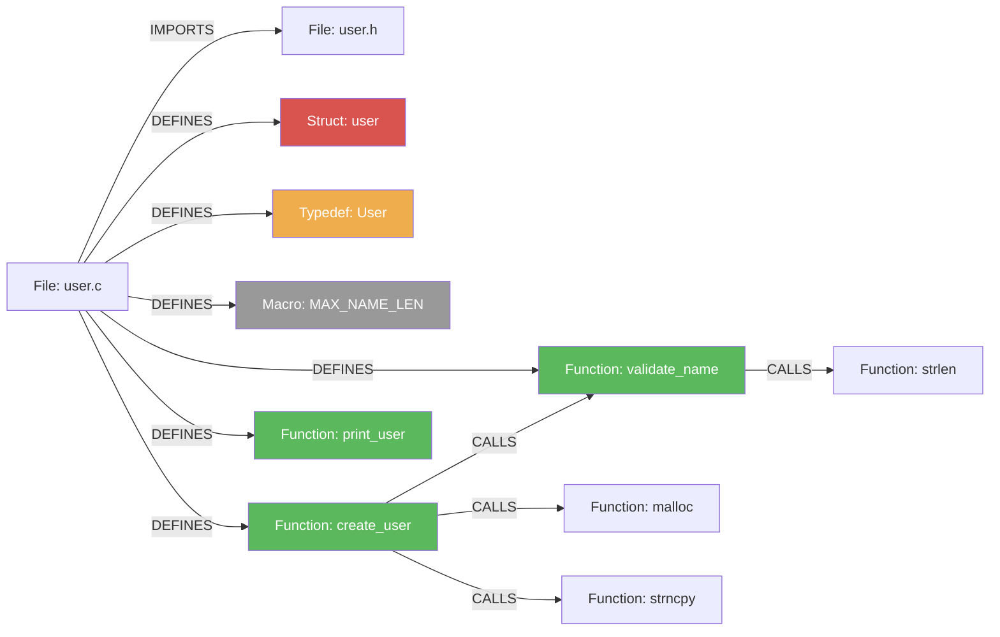

# C Indexing

[← Back to Code Indexing Overview](../README.md)

## Overview

- **Parser:** tree-sitter-c
- **File extensions:** `.c`
- **Language enum:** `SupportedLanguages.C`
- **Query constant:** `C_QUERIES` (in `src/core/ingestion/tree-sitter-queries.ts`)

> **Note on `.h` files:** Header files with the `.h` extension are parsed as C++ (via tree-sitter-cpp), not C. This is intentional -- tree-sitter-cpp is a strict superset of tree-sitter-c, so pure-C headers parse correctly, while C++ headers (with classes, templates, namespaces) are also handled. Only `.c` files use the C parser and C queries.

C indexing captures functions (including pointer-returning variants up to double pointers), structs, unions, enums, typedefs, preprocessor macros, `#include` directives, and function calls. There is no inheritance system in C, so no heritage queries exist.

---

## What Gets Extracted

### Definitions (Graph Nodes)

| AST Node Type | Capture Key | Graph Node Label | Example Code |
|---|---|---|---|
| `function_definition` | `@definition.function` | **Function** | `int main(int argc, char **argv) { }` |
| `declaration` (function prototype) | `@definition.function` | **Function** | `int parse_config(const char *path);` |
| `struct_specifier` | `@definition.struct` | **Struct** | `struct user { char *name; int age; };` |
| `union_specifier` | `@definition.union` | **Union** | `union value { int i; float f; };` |
| `enum_specifier` | `@definition.enum` | **Enum** | `enum status { OK, ERR };` |
| `type_definition` | `@definition.typedef` | **Typedef** | `typedef struct user User;` |
| `preproc_function_def` | `@definition.macro` | **Macro** | `#define MAX(a,b) ((a)>(b)?(a):(b))` |
| `preproc_def` | `@definition.macro` | **Macro** | `#define VERSION 3` |

Each definition produces:

1. A graph node with the appropriate label, `name`, `filePath`, `startLine`, `endLine`, `language: "c"`, and `isExported`.
2. A `DEFINES` edge from the enclosing `File` node to the definition node.
3. A symbol-table entry used for cross-file call resolution.

### Pointer-Returning Function Variants

C functions that return pointers have a different AST shape due to the way declarators nest in the grammar. The queries handle three levels:

```
; Direct: int foo() { }
(function_definition
  declarator: (function_declarator
    declarator: (identifier) @name)) @definition.function

; Single pointer: int *foo() { }
(function_definition
  declarator: (pointer_declarator
    declarator: (function_declarator
      declarator: (identifier) @name))) @definition.function

; Double pointer: int **foo() { }
(function_definition
  declarator: (pointer_declarator
    declarator: (pointer_declarator
      declarator: (function_declarator
        declarator: (identifier) @name)))) @definition.function
```

The same patterns apply to `declaration` nodes (function prototypes in headers).

### Imports (IMPORTS edges)

```
(preproc_include path: (_) @import.source) @import
```

Both angle-bracket and quoted include forms are captured:

| C Code | Captured `@import.source` | Notes |
|---|---|---|
| `#include <stdio.h>` | `<stdio.h>` | System header (including angle brackets) |
| `#include "config.h"` | `"config.h"` | Local header (including quotes) |

The import processor resolves quoted includes to `File` nodes in the graph and creates `IMPORTS` edges. System headers (`<...>`) that are not part of the indexed codebase remain unresolved.

### Calls (CALLS edges)

| AST Pattern | Capture | Example Code |
|---|---|---|
| `call_expression function: (identifier)` | `@call.name` | `parse_config(path)` -- captures `parse_config` |
| `call_expression function: (field_expression field:)` | `@call.name` | `ctx->handler(req)` -- captures `handler` |

Call resolution creates `CALLS` edges from the enclosing function to the resolved target. The `field_expression` pattern captures indirect calls through struct pointers, which are common in C for callback and vtable patterns.

### Inheritance

C has no class system, so there are no heritage queries. Struct embedding and function-pointer vtables are idiomatic inheritance-like patterns in C, but they are not captured by the tree-sitter queries.

---

## Annotated Example

### Source: `user.c`

```c
#include <stdio.h>                      // IMPORTS edge (unresolved: system header)
#include "user.h"                       // IMPORTS edge → user.h

#define MAX_NAME_LEN 64                 // Macro node

typedef struct user {                   // Struct node: "user"
    char name[MAX_NAME_LEN];
    int  age;
} User;                                 // Typedef node: "User"

static int validate_name(const char *name) {   // Function node (not exported)
    return name != NULL && strlen(name) > 0;   // CALLS → strlen
}

User *create_user(const char *name, int age) { // Function node (pointer return)
    if (!validate_name(name)) return NULL;      // CALLS → validate_name
    User *u = malloc(sizeof(User));             // CALLS → malloc
    strncpy(u->name, name, MAX_NAME_LEN - 1);  // CALLS → strncpy
    u->age = age;
    return u;
}

void print_user(const User *u) {               // Function node
    printf("User: %s, age %d\n",               // CALLS → printf (filtered: built-in)
           u->name, u->age);
}
```

### Resulting Graph



Note: `printf` is in the `BUILT_IN_NAMES` set and is filtered out during call extraction, so no CALLS edge is created for it.

---

## Extraction Details

### Function Definitions vs Declarations

Both `function_definition` (with body) and `declaration` (prototype without body) are captured as Function nodes. This means that a header file declaring `int foo(int x);` and a `.c` file defining `int foo(int x) { ... }` will both produce a Function node. The symbol table uses the `(filePath, name)` pair as the key, so the same function defined in two files creates two distinct nodes.

### Declarator Unwrapping

The `extractFunctionName` utility in `utils.ts` handles the C declarator nesting at runtime:

```
function_definition
  └─ pointer_declarator          (return type is a pointer)
       └─ pointer_declarator     (double pointer)
            └─ function_declarator
                 └─ identifier   ← name extracted here
```

The queries must explicitly match each nesting depth because tree-sitter queries do not support recursive/wildcard patterns in the middle of a path.

### Return Type Extraction

For Function nodes, the method-signature extractor reads the `type` field on the `function_definition` node:

| C Code | Extracted `returnType` |
|---|---|
| `int foo()` | `int` |
| `const char *bar()` | `const char` |
| `void baz()` | _(not stored -- void is skipped)_ |

### Export Detection

C has no module-level export syntax. The `isExported` heuristic checks:

- Functions marked `static` are `isExported: false` (file-scoped linkage).
- All other functions default to `isExported: true` (external linkage).

### Built-in Filtering

The following C-relevant names are in the `BUILT_IN_NAMES` set and are excluded from CALLS edges:

- **Standard library:** `printf`, `fprintf`, `sprintf`, `snprintf`, `scanf`, `fscanf`, `sscanf`
- **Memory:** `malloc`, `calloc`, `realloc`, `free`, `memcpy`, `memmove`, `memset`, `memcmp`
- **Strings:** `strlen`, `strcpy`, `strncpy`, `strcat`, `strncat`, `strcmp`, `strncmp`, `strstr`, `strchr`, `strrchr`
- **Conversion:** `atoi`, `atol`, `atof`, `strtol`, `strtoul`, `strtoll`, `strtoull`, `strtod`
- **I/O:** `fopen`, `fclose`, `fread`, `fwrite`, `fseek`, `ftell`, `rewind`, `fflush`, `fgets`, `fputs`
- **Process:** `assert`, `abort`, `exit`, `_exit`
- **Linux kernel macros:** `likely`, `unlikely`, `BUG_ON`, `WARN_ON`, `pr_info`, `pr_err`, `printk`, `kmalloc`, `kfree`, `kzalloc`, etc.

> **Design note:** `open`, `read`, `write`, `close` were intentionally removed from the built-in set because they are real POSIX syscalls that are valid call targets in systems code.

---

## Node Type Matrix

| C Construct | Graph Label | Notes |
|---|---|---|
| `int foo() { }` | Function | Definition with body |
| `int foo();` | Function | Forward declaration / prototype |
| `int *foo() { }` | Function | Pointer-returning (single `*`) |
| `int **foo() { }` | Function | Double-pointer-returning |
| `struct bar { }` | Struct | Named struct |
| `union baz { }` | Union | Named union |
| `enum qux { }` | Enum | Named enum |
| `typedef X Y;` | Typedef | Type alias |
| `#define FOO 1` | Macro | Object-like macro |
| `#define BAR(x) (x)` | Macro | Function-like macro |
| `#include "x.h"` | _(IMPORTS edge)_ | No standalone node; File-level edge |
| `foo(arg)` | _(CALLS edge)_ | Free function call |
| `ptr->method(arg)` | _(CALLS edge)_ | Indirect call via struct pointer |

---

## Tree-sitter Query Reference

The full query string used for C extraction:

```scheme
; Functions (direct declarator)
(function_definition declarator: (function_declarator declarator: (identifier) @name)) @definition.function
(declaration declarator: (function_declarator declarator: (identifier) @name)) @definition.function

; Functions returning pointers (pointer_declarator wraps function_declarator)
(function_definition declarator: (pointer_declarator declarator: (function_declarator declarator: (identifier) @name))) @definition.function
(declaration declarator: (pointer_declarator declarator: (function_declarator declarator: (identifier) @name))) @definition.function

; Functions returning double pointers (nested pointer_declarator)
(function_definition declarator: (pointer_declarator declarator: (pointer_declarator declarator: (function_declarator declarator: (identifier) @name)))) @definition.function

; Structs, Unions, Enums, Typedefs
(struct_specifier name: (type_identifier) @name) @definition.struct
(union_specifier name: (type_identifier) @name) @definition.union
(enum_specifier name: (type_identifier) @name) @definition.enum
(type_definition declarator: (type_identifier) @name) @definition.typedef

; Macros
(preproc_function_def name: (identifier) @name) @definition.macro
(preproc_def name: (identifier) @name) @definition.macro

; Includes
(preproc_include path: (_) @import.source) @import

; Calls
(call_expression function: (identifier) @call.name) @call
(call_expression function: (field_expression field: (field_identifier) @call.name)) @call
```

---

## Known Quirks and Limitations

1. **Triple-pointer functions are not captured.** The queries handle up to double pointer (`int **foo()`). Functions returning `int ***foo()` (extremely rare) will not be indexed.

2. **Function pointers as struct fields are not captured.** A declaration like `void (*callback)(int)` inside a struct body does not match any definition query. The struct itself is captured, but its function-pointer members are invisible.

3. **Macro expansion is not performed.** Macros that generate function definitions (e.g., `DEFINE_HANDLER(name)`) produce no nodes. Only the `#define` itself is captured as a Macro node.

4. **`#include` path resolution is best-effort.** Quoted includes (`"foo.h"`) are resolved against the file tree. Angle-bracket includes (`<stdio.h>`) are resolved only if the system header happens to be in the indexed tree.

5. **Forward declarations of structs** (`struct foo;` without a body) are captured as Struct nodes. This can produce duplicate Struct nodes when both the forward declaration and the full definition exist in different files.

6. **Anonymous structs/unions/enums are not captured.** The queries require a `name:` field, so `struct { int x; }` is invisible.
