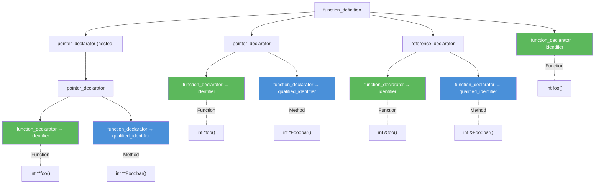
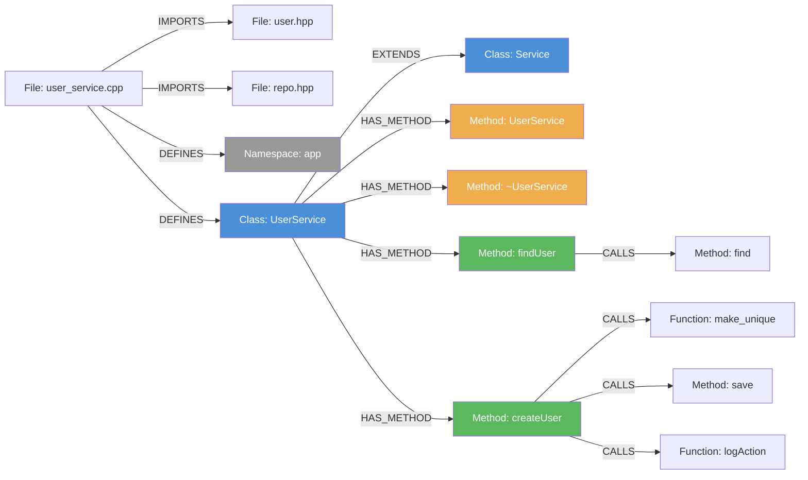

# C++ Indexing

[← Back to Code Indexing Overview](../README.md)

## Overview

- **Parser:** tree-sitter-cpp
- **File extensions:** `.cpp`, `.cc`, `.cxx`, `.hpp`, `.hh`, `.hxx`, `.h`
- **Language enum:** `SupportedLanguages.CPlusPlus`
- **Query constant:** `CPP_QUERIES` (in `src/core/ingestion/tree-sitter-queries.ts`)

> **Note on `.h` files:** All `.h` files are parsed as C++ regardless of content. tree-sitter-cpp is a strict superset of tree-sitter-c, so pure-C headers parse correctly, while C++ headers with classes, templates, and namespaces are handled properly. Only `.c` files use the C parser.

C++ has the most comprehensive query set of all supported languages. It handles classes, structs, namespaces, enums, typedefs, unions, macros, functions, methods (including pointer-returning, reference-returning, and destructor variants), templates, `#include` directives, multiple call patterns, and class hierarchy with access specifiers.

---

## What Gets Extracted

### Definitions (Graph Nodes)

| AST Node Type | Capture Key | Graph Node Label | Example Code |
|---|---|---|---|
| `class_specifier` | `@definition.class` | **Class** | `class UserService { };` |
| `struct_specifier` | `@definition.struct` | **Struct** | `struct Point { int x, y; };` |
| `namespace_definition` | `@definition.namespace` | **Namespace** | `namespace util { }` |
| `enum_specifier` | `@definition.enum` | **Enum** | `enum class Color { Red, Green };` |
| `type_definition` | `@definition.typedef` | **Typedef** | `typedef unsigned int uint;` |
| `union_specifier` | `@definition.union` | **Union** | `union Value { int i; float f; };` |
| `preproc_function_def` | `@definition.macro` | **Macro** | `#define LIKELY(x) __builtin_expect(!!(x), 1)` |
| `preproc_def` | `@definition.macro` | **Macro** | `#define VERSION 3` |
| `function_definition` (unqualified) | `@definition.function` | **Function** | `int main() { }` |
| `function_definition` (qualified) | `@definition.method` | **Method** | `void Foo::bar() { }` |
| `field_declaration` (in class body) | `@definition.method` | **Method** | `void process();` (declaration inside class) |
| `field_declaration_list` inline def | `@definition.method` | **Method** | `void run() { ... }` (inline in class body) |
| `function_definition` (destructor) | `@definition.method` | **Method** | `Foo::~Foo() { }` |
| `template_declaration` (class) | `@definition.template` | **Template** | `template<typename T> class Vec { };` |
| `template_declaration` (function) | `@definition.template` | **Template** | `template<typename T> T max(T a, T b)` |
| `declaration` (prototype) | `@definition.function` | **Function** | `int parse(const char *s);` |

### Qualified vs Unqualified: Function or Method?

The distinction between Function and Method nodes in C++ depends on whether the declarator contains a `qualified_identifier`:

```
; Unqualified → Function
(function_definition
  declarator: (function_declarator
    declarator: (identifier) @name)) @definition.function

; Qualified (ClassName::methodName) → Method
(function_definition
  declarator: (function_declarator
    declarator: (qualified_identifier
      name: (identifier) @name))) @definition.method
```

This means:
- `void foo() { }` produces a **Function** node.
- `void MyClass::foo() { }` produces a **Method** node.

### Pointer, Double-Pointer, and Reference Return Types

C++ return types introduce `pointer_declarator` and `reference_declarator` wrappers around the `function_declarator`. The queries handle all combinations:



### Inline Class Method Definitions

Methods defined directly inside a class body (without an out-of-class implementation) use a different AST structure:

```scheme
; Declaration only (no body): void process();
(field_declaration
  declarator: (function_declarator
    declarator: (identifier) @name)) @definition.method

; Inline definition (with body): void run() { ... }
(field_declaration_list
  (function_definition
    declarator: (function_declarator
      declarator: [(field_identifier) (identifier)
                   (operator_name) (destructor_name)] @name))) @definition.method
```

The alternation `[(field_identifier) (identifier) (operator_name) (destructor_name)]` ensures that operator overloads (`operator+`), destructors (`~Foo`), and regular methods are all captured when defined inline.

### Templates

Template classes and template functions are captured with a separate `Template` label:

```scheme
(template_declaration
  (class_specifier name: (type_identifier) @name)) @definition.template

(template_declaration
  (function_definition
    declarator: (function_declarator
      declarator: (identifier) @name))) @definition.template
```

This means `template<typename T> class Vec { }` produces a **Template** node (not Class), and `template<typename T> T max(T a, T b)` produces a **Template** node (not Function).

### Imports (IMPORTS edges)

```scheme
(preproc_include path: (_) @import.source) @import
```

| C++ Code | Captured `@import.source` | Notes |
|---|---|---|
| `#include <vector>` | `<vector>` | Standard library header |
| `#include <iostream>` | `<iostream>` | Standard library header |
| `#include "user.hpp"` | `"user.hpp"` | Project-local header |

### Calls (CALLS edges)

| AST Pattern | Capture | Example Code |
|---|---|---|
| `call_expression function: (identifier)` | `@call.name` | `init()` -- free function call |
| `call_expression function: (field_expression field:)` | `@call.name` | `obj.process()` or `ptr->run()` |
| `call_expression function: (qualified_identifier name:)` | `@call.name` | `std::sort(v.begin(), v.end())` -- captures `sort` |
| `call_expression function: (template_function name:)` | `@call.name` | `make_shared<User>(args)` -- captures `make_shared` |
| `new_expression type:` | `@call.name` | `new UserService()` -- constructor call |

The `qualified_identifier` pattern captures namespace-scoped calls (`ns::func()`), while `template_function` captures explicit template invocations (`func<T>()`). The `field_expression` pattern handles both dot (`.`) and arrow (`->`) member access.

### Inheritance (EXTENDS edges)

```scheme
; Without access specifier: class Derived : Base
(class_specifier name: (type_identifier) @heritage.class
  (base_class_clause (type_identifier) @heritage.extends)) @heritage

; With access specifier: class Derived : public Base
(class_specifier name: (type_identifier) @heritage.class
  (base_class_clause (access_specifier) (type_identifier) @heritage.extends)) @heritage
```

Both patterns produce `EXTENDS` edges. C++ does not have a separate interface concept at the language level (abstract classes serve that role), so all heritage is captured as EXTENDS. The heritage processor's symbol-table resolution may reclassify some as IMPLEMENTS if the parent is registered as an Interface node, but this is uncommon in C++ codebases.

> **Multiple inheritance:** Each base class in the `base_class_clause` is captured as a separate `@heritage.extends`, so `class D : public A, public B` produces two EXTENDS edges.

---

## Annotated Example

### Source: `user_service.cpp`

```cpp
#include "user.hpp"                          // IMPORTS → user.hpp
#include "repo.hpp"                          // IMPORTS → repo.hpp
#include <memory>                            // IMPORTS (unresolved: stdlib)

namespace app {                              // Namespace node: "app"

class UserService : public Service {         // Class node + EXTENDS → Service
public:
    UserService(UserRepo* repo)              // Method node (inline constructor)
        : repo_(repo) {}

    ~UserService() override {}               // Method node (inline destructor)

    User* findUser(int id) {                 // Method node (inline, pointer return)
        return repo_->find(id);              // CALLS → find
    }

    void createUser(const std::string& name) {  // Method node
        auto user = std::make_unique<User>(name);  // CALLS → make_unique
        repo_->save(std::move(user));               // CALLS → save
        logAction("create");                        // CALLS → logAction
    }

private:
    UserRepo* repo_;
};

}  // namespace app
```

### Resulting Graph



---

## Extraction Details

### Method Signature Extraction

For Method, Function, and Constructor nodes, the parser extracts:

- **`parameterCount`** -- number of formal parameters. C/C++ variadic functions (`int printf(const char *fmt, ...)`) have a bare `...` token in the parameter list, which sets `parameterCount: undefined`.
- **`returnType`** -- extracted from the `type` field on `function_definition`. The `void` return type is intentionally skipped (not stored).

### Export Detection

C++ uses the same heuristic as C:

- `static` functions/variables are `isExported: false` (internal linkage).
- Everything else defaults to `isExported: true`.

Visibility attributes (`__attribute__((visibility("hidden")))`) and `__declspec(dllexport)` are not currently parsed.

### Enclosing Class Detection

The `findEnclosingClassId` utility walks up the AST from a method node to find the enclosing `class_specifier` or `struct_specifier`. For out-of-class method definitions (`void Foo::bar() { }`), the qualified identifier is used -- the `extractFunctionName` utility unwraps `pointer_declarator` / `reference_declarator` wrappers and extracts the class name from the `qualified_identifier` scope.

### Built-in Filtering

The following C++-relevant names are in the `BUILT_IN_NAMES` set and are excluded from CALLS edges:

- All C standard library names (see C Indexing doc)
- Linux kernel macros and helpers: `likely`, `unlikely`, `pr_info`, `printk`, `kmalloc`, `kfree`, etc.
- C++ operators like `sizeof`, `typeof`, `offsetof`

> **Note:** C++ standard library calls like `std::sort`, `std::find`, `std::make_shared` are NOT in the built-in set and WILL produce CALLS edges. Only the unqualified name is checked against the set (`sort`, `find`, `make_shared`), and common container method names like `push`, `pop`, `insert`, `find` overlap with the built-in list.

---

## Node Type Matrix

| C++ Construct | Graph Label | Notes |
|---|---|---|
| `class Foo { }` | Class | |
| `struct Bar { }` | Struct | |
| `namespace ns { }` | Namespace | |
| `enum Color { }` | Enum | Includes `enum class` |
| `typedef X Y` | Typedef | |
| `union U { }` | Union | |
| `#define FOO` | Macro | Object-like and function-like |
| `int foo() { }` | Function | Unqualified free function |
| `void Foo::bar() { }` | Method | Qualified (out-of-class definition) |
| `int *foo() { }` | Function | Pointer-returning |
| `int &Foo::bar() { }` | Method | Reference-returning, qualified |
| `Foo::~Foo() { }` | Method | Destructor |
| `void run() { }` (in class) | Method | Inline definition |
| `void run();` (in class) | Method | Inline declaration |
| `operator+(...)` (in class) | Method | Operator overload |
| `template<T> class V { }` | Template | Template class |
| `template<T> T max(T, T)` | Template | Template function |
| `#include "x.h"` | _(IMPORTS edge)_ | File-level edge |
| `foo(arg)` | _(CALLS edge)_ | Free function call |
| `obj.bar()` | _(CALLS edge)_ | Member call (dot) |
| `ptr->bar()` | _(CALLS edge)_ | Member call (arrow) |
| `ns::func()` | _(CALLS edge)_ | Namespace-qualified call |
| `func<T>(arg)` | _(CALLS edge)_ | Template function call |
| `new Foo()` | _(CALLS edge)_ | Constructor call |
| `class D : B` | _(EXTENDS edge)_ | Without access specifier |
| `class D : public B` | _(EXTENDS edge)_ | With access specifier |

---

## Tree-sitter Query Reference

The full query string used for C++ extraction:

```scheme
; Classes, Structs, Namespaces
(class_specifier name: (type_identifier) @name) @definition.class
(struct_specifier name: (type_identifier) @name) @definition.struct
(namespace_definition name: (namespace_identifier) @name) @definition.namespace
(enum_specifier name: (type_identifier) @name) @definition.enum

; Typedefs and unions (common in C-style headers and mixed C/C++ code)
(type_definition declarator: (type_identifier) @name) @definition.typedef
(union_specifier name: (type_identifier) @name) @definition.union

; Macros
(preproc_function_def name: (identifier) @name) @definition.macro
(preproc_def name: (identifier) @name) @definition.macro

; Functions & Methods (direct declarator)
(function_definition declarator: (function_declarator declarator: (identifier) @name)) @definition.function
(function_definition declarator: (function_declarator declarator: (qualified_identifier name: (identifier) @name))) @definition.method

; Functions/methods returning pointers (pointer_declarator wraps function_declarator)
(function_definition declarator: (pointer_declarator declarator: (function_declarator declarator: (identifier) @name))) @definition.function
(function_definition declarator: (pointer_declarator declarator: (function_declarator declarator: (qualified_identifier name: (identifier) @name)))) @definition.method

; Functions/methods returning double pointers (nested pointer_declarator)
(function_definition declarator: (pointer_declarator declarator: (pointer_declarator declarator: (function_declarator declarator: (identifier) @name)))) @definition.function
(function_definition declarator: (pointer_declarator declarator: (pointer_declarator declarator: (function_declarator declarator: (qualified_identifier name: (identifier) @name))))) @definition.method

; Functions/methods returning references (reference_declarator wraps function_declarator)
(function_definition declarator: (reference_declarator (function_declarator declarator: (identifier) @name))) @definition.function
(function_definition declarator: (reference_declarator (function_declarator declarator: (qualified_identifier name: (identifier) @name)))) @definition.method

; Destructors (destructor_name is distinct from identifier in tree-sitter-cpp)
(function_definition declarator: (function_declarator declarator: (qualified_identifier name: (destructor_name) @name))) @definition.method

; Function declarations / prototypes (common in headers)
(declaration declarator: (function_declarator declarator: (identifier) @name)) @definition.function
(declaration declarator: (pointer_declarator declarator: (function_declarator declarator: (identifier) @name))) @definition.function

; Inline class method declarations (inside class body, no body: void Foo();)
(field_declaration declarator: (function_declarator declarator: (identifier) @name)) @definition.method

; Inline class method definitions (inside class body, with body: void Foo() { ... })
(field_declaration_list
  (function_definition
    declarator: (function_declarator
      declarator: [(field_identifier) (identifier) (operator_name) (destructor_name)] @name))) @definition.method

; Templates
(template_declaration (class_specifier name: (type_identifier) @name)) @definition.template
(template_declaration (function_definition declarator: (function_declarator declarator: (identifier) @name))) @definition.template

; Includes
(preproc_include path: (_) @import.source) @import

; Calls
(call_expression function: (identifier) @call.name) @call
(call_expression function: (field_expression field: (field_identifier) @call.name)) @call
(call_expression function: (qualified_identifier name: (identifier) @call.name)) @call
(call_expression function: (template_function name: (identifier) @call.name)) @call

; Constructor calls: new User()
(new_expression type: (type_identifier) @call.name) @call

; Heritage
(class_specifier name: (type_identifier) @heritage.class
  (base_class_clause (type_identifier) @heritage.extends)) @heritage
(class_specifier name: (type_identifier) @heritage.class
  (base_class_clause (access_specifier) (type_identifier) @heritage.extends)) @heritage
```

---

## Known Quirks and Limitations

1. **Template specializations are not captured separately.** A `template<> class Vec<int>` full specialization creates a Template node with the same name as the primary template. Partial specializations behave similarly.

2. **`using` declarations and `using namespace` are not captured.** These affect name resolution but do not produce import edges. Only `#include` creates IMPORTS edges.

3. **Operator overloads defined out-of-class** (e.g., `bool operator==(const Foo& a, const Foo& b)`) are captured as Function nodes (unqualified) rather than Method nodes, because the declarator is not a `qualified_identifier`.

4. **Virtual/override/final keywords** are not parsed. All methods are treated equally regardless of whether they are virtual, override, or final.

5. **Multiple inheritance** is supported: each base class produces a separate EXTENDS edge. However, virtual inheritance (`class D : virtual public B`) is not distinguished from non-virtual inheritance.

6. **Friend declarations** are not captured. A `friend class Foo;` or `friend void bar();` does not produce any node or edge.

7. **Concepts (C++20)** are not captured. `template<Concept T>` and `requires` clauses are invisible to the queries.

8. **Lambda expressions** are not captured as separate function nodes. Only named functions and methods are indexed.

9. **Nested namespaces** (`namespace a::b::c { }`) -- tree-sitter-cpp represents these as nested `namespace_definition` nodes. Each level is captured as a separate Namespace node.
