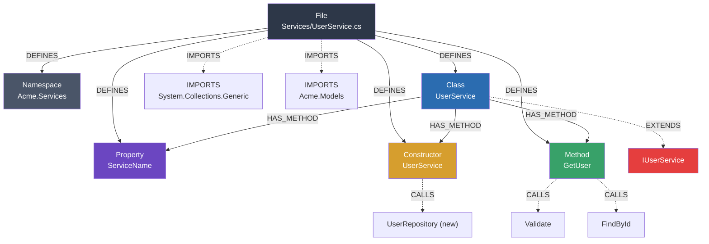

# C# Indexing

[← Back to Code Indexing Overview](../README.md)

## Overview

GitNexus indexes C# source files (`.cs`) using **tree-sitter-c-sharp**. The grammar covers the full modern C# type system including records, delegates, file-scoped namespaces (C# 10+), primary constructors (C# 12), and target-typed `new` expressions (C# 9). Of all supported .NET-family languages, C# produces the richest set of graph node types -- 11 distinct types from a single file.

| Property | Value |
|----------|-------|
| Parser | `tree-sitter-c-sharp` |
| Extensions | `.cs` |
| Query constant | `CSHARP_QUERIES` |
| Node types | Class, Interface, Struct, Enum, Record, Delegate, Namespace, Method, Function, Constructor, Property |

## What Gets Extracted

### Definitions (Graph Nodes)

Every captured definition becomes a node in the knowledge graph with a `DEFINES` edge from the enclosing `File` node. Methods, constructors, and properties also receive a `HAS_METHOD` edge from their enclosing class.

| C# Construct | Query Pattern | Graph Node Label |
|--------------|--------------|-----------------|
| `class Foo` | `class_declaration` | **Class** |
| `interface IFoo` | `interface_declaration` | **Interface** |
| `struct Point` | `struct_declaration` | **Struct** |
| `enum Color` | `enum_declaration` | **Enum** |
| `record User(...)` | `record_declaration` | **Record** |
| `delegate void Handler(...)` | `delegate_declaration` | **Delegate** |
| `namespace Acme.Core` | `namespace_declaration` | **Namespace** |
| `namespace Acme.Core;` (file-scoped) | `file_scoped_namespace_declaration` | **Namespace** |
| `void Process()` | `method_declaration` | **Method** |
| `static int Helper() { }` (local function) | `local_function_statement` | **Function** |
| `Foo(int x)` | `constructor_declaration` | **Constructor** |
| `public string Name { get; set; }` | `property_declaration` | **Property** |
| `class User(string name, int age)` (primary ctor) | `class_declaration` + `parameter_list` | **Constructor** |
| `record Person(string Name)` (primary ctor) | `record_declaration` + `parameter_list` | **Constructor** |

### Imports (IMPORTS edges)

`using` directives are captured and resolved into `IMPORTS` edges during the linking phase.

| C# Syntax | Query Pattern |
|-----------|--------------|
| `using System.Collections.Generic;` | `using_directive` with `qualified_name` |
| `using Newtonsoft;` | `using_directive` with `identifier` |

Both simple and qualified `using` directives are captured. `using static`, `using alias`, and global usings all use the same `using_directive` grammar node and are captured uniformly.

### Calls (CALLS edges)

Call expressions are captured as unresolved call references during parsing, then resolved to target nodes during the linking phase using the symbol table.

| C# Syntax | Query Pattern | What is captured |
|-----------|--------------|-----------------|
| `Process()` | `invocation_expression` with `identifier` | Direct function/method call |
| `obj.Process()` | `invocation_expression` with `member_access_expression` | Member method call |
| `new User()` | `object_creation_expression` | Constructor call |
| `User u = new("x", 5);` | `variable_declaration` + `implicit_object_creation_expression` | Target-typed new (C# 9) |

### Inheritance (EXTENDS edges)

Heritage queries capture class inheritance, producing `EXTENDS` edges in the graph. Interface implementation is captured through the same `base_list` mechanism since C# uses a unified syntax (`: BaseType`).

| C# Syntax | Query Pattern | Edge Type |
|-----------|--------------|----------|
| `class Foo : Bar` | `base_list` with `identifier` | **EXTENDS** |
| `class Foo : IEnumerable<T>` | `base_list` with `generic_name` | **EXTENDS** |

> **Note:** C# does not syntactically distinguish class inheritance from interface implementation in the `base_list`. Both produce `EXTENDS` edges. The convention "first is class, rest are interfaces" cannot be reliably determined from the AST alone.

## Annotated Example

Consider the following C# file `Services/UserService.cs`:

```csharp
using System.Collections.Generic;
using Acme.Models;

namespace Acme.Services;                        // (1) file-scoped namespace

public class UserService : IUserService         // (2) class + heritage
{
    public string ServiceName { get; set; }     // (3) property

    public UserService(ILogger logger)          // (4) constructor
    {
        var repo = new UserRepository();        // (5) constructor call
    }

    public User GetUser(int id)                 // (6) method
    {
        Validate(id);                           // (7) direct call
        return repo.FindById(id);               // (8) member call
    }

    static int CountActive() => users.Count();  // (9) local-style call
}
```

The extraction pipeline produces the following graph:



**Solid edges** are high-confidence relationships resolved within the file. **Dashed edges** are resolved during the cross-file linking phase (import resolution, call resolution, heritage resolution).

## Extraction Details

### Namespace Handling

C# supports two namespace forms:

1. **Block-scoped** (traditional): `namespace Acme.Core { ... }` -- captured via `namespace_declaration`
2. **File-scoped** (C# 10+): `namespace Acme.Core;` -- captured via `file_scoped_namespace_declaration`

Both `identifier` (simple) and `qualified_name` (dotted) variants are captured. File-scoped namespaces produce the same `Namespace` node as block-scoped ones.

### Primary Constructors (C# 12)

Primary constructors on classes and records are captured through a combined pattern:

```
(class_declaration name: (identifier) @name (parameter_list) @definition.constructor)
(record_declaration name: (identifier) @name (parameter_list) @definition.constructor)
```

This means `class User(string name, int age) { }` produces both a **Class** node (from the `class_declaration` query) and a **Constructor** node (from the primary constructor query).

### Target-Typed New (C# 9)

The expression `User u = new("Alice", 30)` omits the type name on the `new` keyword. The type is inferred from the variable declaration:

```
(variable_declaration type: (identifier) @call.name
  (variable_declarator (implicit_object_creation_expression) @call))
```

This captures `User` as the call target by reading the declared variable type.

### Heritage Ambiguity

C# uses a single `base_list` for both class inheritance and interface implementation:

```csharp
class Foo : BaseClass, IFirst, ISecond { }
```

All three (`BaseClass`, `IFirst`, `ISecond`) are captured from the `base_list` as `heritage.extends`. The generic form `IEnumerable<T>` uses `generic_name` to capture the outer type identifier, stripping the type parameter.

### Export Detection

C# uses access modifiers (`public`, `internal`, `protected`, `private`) rather than an `export` keyword. The `isExported` property on graph nodes is determined by the export-detection module checking the AST for `public` or `internal` modifiers.

## Node Type Matrix

| Definition Capture Key | Graph Node Label | Multiple per file? | Can have `HAS_METHOD` children? |
|----------------------|-----------------|-------------------|-------------------------------|
| `definition.class` | Class | Yes | Yes |
| `definition.interface` | Interface | Yes | Yes |
| `definition.struct` | Struct | Yes | Yes |
| `definition.enum` | Enum | Yes | No |
| `definition.record` | Record | Yes | Yes |
| `definition.delegate` | Delegate | Yes | No |
| `definition.namespace` | Namespace | Yes (block) / Once (file-scoped) | No |
| `definition.method` | Method | Yes | No (is child) |
| `definition.function` | Function | Yes | No (is child) |
| `definition.constructor` | Constructor | Yes | No (is child) |
| `definition.property` | Property | Yes | No (is child) |
