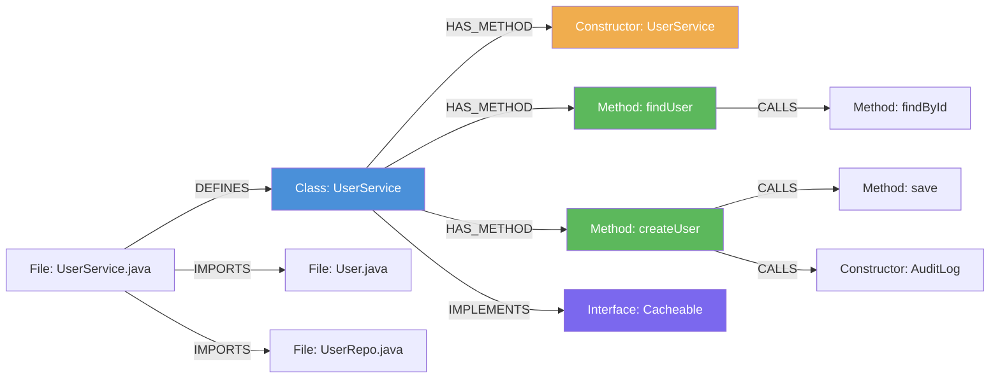

# Java Indexing

[← Back to Code Indexing Overview](../README.md)

## Overview

- **Parser:** tree-sitter-java
- **File extensions:** `.java`
- **Language enum:** `SupportedLanguages.Java`
- **Query constant:** `JAVA_QUERIES` (in `src/core/ingestion/tree-sitter-queries.ts`)

Java indexing captures the full OOP surface of a Java codebase: classes, interfaces, enums, annotations, methods, constructors, import statements, method invocations, object creation, and the class hierarchy (extends + implements).

---

## What Gets Extracted

### Definitions (Graph Nodes)

| AST Node Type | Capture Key | Graph Node Label | Example Code |
|---|---|---|---|
| `class_declaration` | `@definition.class` | **Class** | `public class UserService { }` |
| `interface_declaration` | `@definition.interface` | **Interface** | `public interface Cacheable { }` |
| `enum_declaration` | `@definition.enum` | **Enum** | `public enum Status { ACTIVE, INACTIVE }` |
| `annotation_type_declaration` | `@definition.annotation` | **Annotation** | `public @interface Deprecated { }` |
| `method_declaration` | `@definition.method` | **Method** | `public void save(User u) { }` |
| `constructor_declaration` | `@definition.constructor` | **Constructor** | `public UserService(Repo repo) { }` |

Each definition produces:

1. A graph node with `label`, `name`, `filePath`, `startLine`, `endLine`, `language: "java"`, and `isExported`.
2. A `DEFINES` edge from the enclosing `File` node to the definition node.
3. A `HAS_METHOD` edge from the enclosing class/interface to method/constructor nodes.
4. A symbol-table entry used for cross-file resolution.

### Imports (IMPORTS edges)

```
(import_declaration (_) @import.source) @import
```

The wildcard `(_)` captures the entire import path regardless of whether it is a `scoped_identifier` or an `identifier` node, covering both single-class and wildcard imports:

| Java Code | Captured `@import.source` |
|---|---|
| `import java.util.List;` | `java.util.List` |
| `import java.util.*;` | `java.util.*` |
| `import static org.junit.Assert.assertEquals;` | `org.junit.Assert.assertEquals` |

Import sources are resolved by the import processor into `IMPORTS` edges pointing at the target `File` node.

### Calls (CALLS edges)

| AST Pattern | Capture | Example Code |
|---|---|---|
| `method_invocation name:` | `@call.name` | `userRepo.findById(id)` -- captures `findById` |
| `method_invocation object: name:` | `@call.name` | `this.validate(user)` -- captures `validate` |
| `object_creation_expression type:` | `@call.name` | `new ArrayList<>()` -- captures `ArrayList` |

Call resolution in the call processor uses the symbol table and import map to create `CALLS` edges from the enclosing function/method to the resolved target. Member calls (those with an `object` field) are distinguished from free calls via `inferCallForm`. Constructor calls (`new Foo()`) are tagged as `constructor` form.

### Inheritance (EXTENDS / IMPLEMENTS edges)

| AST Pattern | Capture Names | Edge Type | Example Code |
|---|---|---|---|
| `class_declaration → superclass` | `@heritage.class`, `@heritage.extends` | **EXTENDS** | `class Admin extends User` |
| `class_declaration → super_interfaces → type_list` | `@heritage.class`, `@heritage.implements` | **IMPLEMENTS** | `class UserService implements Cacheable` |

Heritage resolution uses the symbol table to confirm whether a parent is a Class or Interface. For unresolved external symbols, Java applies the `I[A-Z]` naming convention heuristic (e.g., `IDisposable` is treated as an interface).

---

## Annotated Example

### Source: `UserService.java`

```java
package com.example.service;

import com.example.model.User;         // IMPORTS edge → User.java
import com.example.repo.UserRepo;      // IMPORTS edge → UserRepo.java

public class UserService implements Cacheable {   // Class node + IMPLEMENTS edge

    private final UserRepo repo;

    public UserService(UserRepo repo) {           // Constructor node
        this.repo = repo;
    }

    public User findUser(String id) {             // Method node
        return repo.findById(id);                 // CALLS edge → findById
    }

    public void createUser(User user) {           // Method node
        repo.save(user);                          // CALLS edge → save
        new AuditLog(user.getName());             // CALLS edge → AuditLog (constructor)
    }
}
```

### Resulting Graph



---

## Extraction Details

### Method Signature Extraction

For Method and Constructor nodes, the parser extracts:

- **`parameterCount`** -- number of formal parameters (excluding variadic `Object... args`, which sets `parameterCount: undefined`).
- **`returnType`** -- extracted from the `type_annotation` child when present.

These are stored as node properties and used by the call processor for method-resolution-order (MRO) disambiguation when multiple methods share the same name.

### Export Detection

Java has no `export` keyword. The `isExported` flag is set based on access modifiers:

- `public` declarations are marked `isExported: true`.
- Package-private, `protected`, and `private` declarations are `isExported: false`.

### Framework Detection

The AST text of each definition (first 300 characters) is passed through `detectFrameworkFromAST`, which recognizes common Java frameworks:

| Annotation Pattern | Framework Hint | Entry Point Multiplier |
|---|---|---|
| `@Controller`, `@RestController` | Spring MVC | High |
| `@GetMapping`, `@PostMapping`, `@RequestMapping` | Spring MVC Route | High |
| `@Service`, `@Repository`, `@Component` | Spring Bean | Medium |
| `@Entity`, `@Table` | JPA Entity | Low |

These multipliers boost the symbol's score during process detection, so Spring controller methods are more likely to be identified as execution-flow entry points.

### Built-in Filtering

The following Java-related names are in the `BUILT_IN_NAMES` set and are filtered out of call extraction to reduce noise:

- Standard library: `toString`, `valueOf`, `hashCode`, `equals`
- Collections: `add`, `remove`, `contains`, `clear`, `size`

---

## Node Type Matrix

| Java Construct | Graph Label | Notes |
|---|---|---|
| `class Foo` | Class | Includes abstract classes |
| `interface Foo` | Interface | |
| `enum Foo` | Enum | |
| `@interface Foo` | Annotation | Custom annotation types |
| `void bar()` | Method | Inside a class body |
| `Foo(int x)` | Constructor | Same name as the class |
| `import x.y.Z` | _(IMPORTS edge)_ | No standalone node; creates File-level edge |
| `foo.bar()` | _(CALLS edge)_ | Resolved via symbol table + imports |
| `new Foo()` | _(CALLS edge)_ | Constructor call form |
| `extends Bar` | _(EXTENDS edge)_ | Single inheritance |
| `implements Baz` | _(IMPLEMENTS edge)_ | Multiple allowed |

---

## Tree-sitter Query Reference

The full query string used for Java extraction:

```scheme
; Classes, Interfaces, Enums, Annotations
(class_declaration name: (identifier) @name) @definition.class
(interface_declaration name: (identifier) @name) @definition.interface
(enum_declaration name: (identifier) @name) @definition.enum
(annotation_type_declaration name: (identifier) @name) @definition.annotation

; Methods & Constructors
(method_declaration name: (identifier) @name) @definition.method
(constructor_declaration name: (identifier) @name) @definition.constructor

; Imports - capture any import declaration child as source
(import_declaration (_) @import.source) @import

; Calls
(method_invocation name: (identifier) @call.name) @call
(method_invocation object: (_) name: (identifier) @call.name) @call

; Constructor calls: new Foo()
(object_creation_expression type: (type_identifier) @call.name) @call

; Heritage - extends class
(class_declaration name: (identifier) @heritage.class
  (superclass (type_identifier) @heritage.extends)) @heritage

; Heritage - implements interfaces
(class_declaration name: (identifier) @heritage.class
  (super_interfaces (type_list (type_identifier) @heritage.implements))) @heritage.impl
```

---

## Known Quirks and Limitations

1. **Enum constants are not individually indexed.** The `enum_declaration` is captured as a single Enum node, but individual values like `ACTIVE`, `INACTIVE` are not extracted as separate nodes.

2. **Anonymous classes are not captured.** An expression like `new Runnable() { ... }` creates a `class_body` without a `class_declaration`, so the anonymous class itself is invisible to the query. Methods inside it are captured if they match `method_declaration`.

3. **Generic type parameters are not preserved.** `List<User>` is captured as `List` -- the type argument is not stored in the graph.

4. **Static imports** are captured the same way as regular imports. The import processor does not currently distinguish between static and non-static imports.

5. **Inner/nested classes** are captured as top-level Class nodes. The enclosing-class relationship is established via `HAS_METHOD` / `findEnclosingClassId`, but the nesting is not represented as a separate `CONTAINS` edge.
