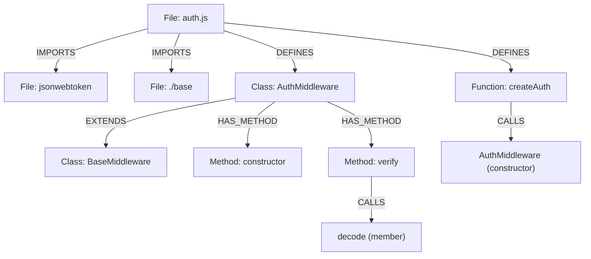

# JavaScript Indexing

[<- Back to Code Indexing Overview](../README.md)

## Overview

- **Parser:** `tree-sitter-javascript`
- **File extensions:** `.js`, `.jsx`, `.mjs`, `.cjs`
- **Special detection rules:** None. JSX files (`.jsx`) use the same JavaScript grammar -- `tree-sitter-javascript` includes JSX syntax support natively.

> Source: `gitnexus/src/core/ingestion/tree-sitter-queries.ts` -- `JAVASCRIPT_QUERIES`
> Language detection: `gitnexus/src/core/ingestion/utils.ts` -- `getLanguageFromFilename()`

---

## What Gets Extracted

### Definitions (-> Graph Nodes)

| AST Node Type | Capture Key | Graph Node Label | Example Code |
|---|---|---|---|
| `class_declaration` | `@definition.class` | **Class** | `class Router { }` |
| `function_declaration` | `@definition.function` | **Function** | `function handleRequest(req, res) { }` |
| `method_definition` | `@definition.method` | **Method** | `process() { }` (inside class) |
| `lexical_declaration` > `variable_declarator` > `arrow_function` | `@definition.function` | **Function** | `const validate = (data) => { }` |
| `lexical_declaration` > `variable_declarator` > `function_expression` | `@definition.function` | **Function** | `const validate = function(data) { }` |
| `export_statement` > `lexical_declaration` > `arrow_function` | `@definition.function` | **Function** | `export const validate = (data) => { }` |
| `export_statement` > `lexical_declaration` > `function_expression` | `@definition.function` | **Function** | `export const validate = function(data) { }` |

### Imports (-> IMPORTS edges)

| AST Pattern | What It Captures | Example |
|---|---|---|
| `import_statement` with `source: (string)` | Module specifier string | `import express from 'express'` |
| `export_statement` with `source: (string)` | Re-export source | `export { handler } from './handler'` |

Import resolution follows the same pipeline as TypeScript: the `@import.source` capture grabs the string literal, and `named-binding-extraction.ts` extracts individual bindings. CommonJS `require()` calls are captured as regular call expressions (CALLS edge to `require`) but are **not** treated as IMPORTS edges by the tree-sitter query -- the import processor handles `require` resolution separately.

### Calls (-> CALLS edges)

| Call Form | AST Pattern | Example |
|---|---|---|
| Free function call | `call_expression` > `function: (identifier)` | `validate(data)` |
| Member/method call | `call_expression` > `function: (member_expression)` > `property: (property_identifier)` | `app.listen(3000)` |
| Constructor call | `new_expression` > `constructor: (identifier)` | `new EventEmitter()` |

Call form discrimination and built-in filtering work identically to TypeScript. See `inferCallForm()` and `isBuiltInOrNoise()` in `utils.ts`.

### Inheritance (-> EXTENDS edges)

| AST Pattern | Edge Type | Example |
|---|---|---|
| `class_declaration` > `class_heritage` > `(identifier)` | **EXTENDS** | `class Admin extends User { }` |

JavaScript has **no `implements` clause** -- the language has no interface construct. The heritage query captures only `extends`. Note that the AST structure differs from TypeScript: JavaScript's `class_heritage` node contains the parent `(identifier)` directly, without an intermediate `extends_clause` wrapper.

---

## Annotated Example

```javascript
// file: src/middleware/auth.js

import jwt from 'jsonwebtoken';                    // (1) IMPORTS -> jsonwebtoken
import { BaseMiddleware } from './base';           // (2) IMPORTS -> ./base

class AuthMiddleware extends BaseMiddleware {       // (3) Class node + EXTENDS -> BaseMiddleware
  constructor(secret) {                             // (4) Method node
    super();                                        // (5) CALLS -> super
    this.secret = secret;
  }

  verify(token) {                                   // (6) Method node
    return jwt.decode(token);                       // (7) CALLS -> decode (member call)
  }
}

export const createAuth = (config) => {            // (8) Function node (exported arrow fn)
  const middleware = new AuthMiddleware(config.secret); // (9) CALLS -> AuthMiddleware (constructor)
  return middleware;
};
```

### Resulting Graph



---

## Extraction Details

### Tree-sitter Query Source

The full query string is defined as `JAVASCRIPT_QUERIES` in:

```
gitnexus/src/core/ingestion/tree-sitter-queries.ts  (lines 81-137)
```

It is selected via the `LANGUAGE_QUERIES` map keyed by `SupportedLanguages.JavaScript`.

### Key Differences from TypeScript

The JavaScript and TypeScript query sets are deliberately separate, despite sharing most patterns. The differences are:

| Feature | TypeScript | JavaScript |
|---|---|---|
| **Interface declarations** | Yes (`interface_declaration`) | No (JS has no interfaces) |
| **Class name node type** | `type_identifier` | `identifier` |
| **Heritage structure** | `extends_clause` > `value: (identifier)` | Direct `(identifier)` child of `class_heritage` |
| **Implements clause** | Yes (`implements_clause`) | No |

These differences stem from the tree-sitter grammars themselves. TypeScript's grammar uses `type_identifier` for type-position names (class declarations, type annotations), while JavaScript uses plain `identifier` everywhere.

### Language-Specific Quirks and Limitations

1. **No interface or type alias support.** JavaScript has no static type system, so `Interface`, `TypeAlias`, and related node types are never produced.

2. **CommonJS `require()` is not an import query.** `const fs = require('fs')` is captured as a call expression (CALLS -> `require`). The import processor resolves `require` calls into IMPORTS edges during a later phase, but this happens outside the tree-sitter query.

3. **JSX elements are not indexed.** `<Component prop={value} />` produces JSX-specific AST nodes that are not matched by any definition or call query. The `Component` reference is not captured as a call.

4. **`var` declarations are not captured.** Only `const` and `let` (`lexical_declaration`) wrapping arrow functions or function expressions produce Function nodes. `var foo = function() {}` is missed. This is intentional -- `var` declarations are considered legacy and rare in modern codebases.

5. **Dynamic imports** (`import('./module')`) are captured as a call to `import`, not as an `import_statement`. They do not produce IMPORTS edges via the tree-sitter query.

6. **Prototype-based inheritance** (`Child.prototype = Object.create(Parent.prototype)`) is not captured. Only ES6 `class` syntax with `extends` produces EXTENDS edges.

7. **Generator functions** (`function* gen() {}`) are not captured by the current query set. Only standard `function_declaration` is matched. Async functions declared with `async function` are captured because tree-sitter wraps them in `function_declaration`.

---

## Node Type Matrix

| Graph Node Type | Produced by JavaScript Indexing |
|---|---|
| Function | Yes (declarations, arrow functions, function expressions) |
| Class | Yes |
| Interface | No (JS has no interfaces) |
| Method | Yes |
| Struct | No |
| Enum | No |
| Namespace | No |
| Module | No |
| Trait | No |
| Impl | No |
| TypeAlias | No |
| Const | No |
| Static | No |
| Typedef | No |
| Macro | No |
| Union | No |
| Property | No |
| Record | No |
| Delegate | No |
| Annotation | No |
| Constructor | No (constructors are captured as Method via `method_definition`) |
| Template | No |
