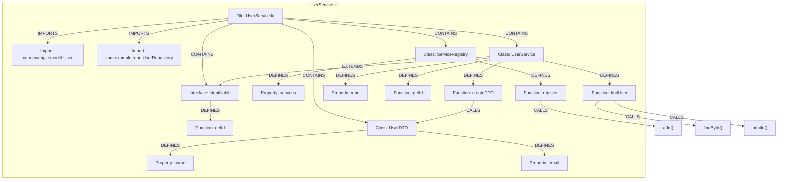

# Kotlin Indexing

[← Back to Code Indexing Overview](../README.md)

## Overview

| Property | Value |
|----------|-------|
| **Parser** | tree-sitter-kotlin ([fwcd/tree-sitter-kotlin](https://github.com/fwcd/tree-sitter-kotlin)) |
| **Extensions** | `.kt`, `.kts` |
| **Query constant** | `KOTLIN_QUERIES` in `src/core/ingestion/tree-sitter-queries.ts` |
| **Call routing** | None (passthrough) |

GitNexus indexes Kotlin source files using tree-sitter-kotlin by fwcd. The parser's grammar differs from other languages in that it does **not** have a dedicated `interface_declaration` node type -- interfaces and classes are both `class_declaration` nodes, differentiated by an anonymous keyword child (`"interface"` vs `"class"`). This design choice means the queries must match on the keyword child to distinguish the two.

## What Gets Extracted

### Definitions

| Kotlin Construct | Capture | Graph Node Label |
|-----------------|---------|------------------|
| `class Foo` | `definition.class` | `Class` |
| `data class Foo` | `definition.class` | `Class` |
| `sealed class Foo` | `definition.class` | `Class` |
| `enum class Foo` | `definition.class` | `Class` |
| `interface Foo` | `definition.interface` | `Interface` |
| `object Foo` | `definition.class` | `Class` |
| `companion object Named` | `definition.class` | `Class` |
| `fun bar()` | `definition.function` | `Function` |
| `val x = ...` / `var x = ...` | `definition.property` | `Property` |
| `enum entry VALUE` | `definition.enum` | `Enum` |
| `typealias Alias = ...` | `definition.type` | `TypeAlias` |

### Imports

```kotlin
import com.example.service.UserService  // captured as import
import kotlinx.coroutines.*             // captured (wildcard in identifier)
```

Each `import_header` is captured as an `@import` with the full `(identifier)` as `@import.source`. The import processor resolves these to `IMPORTS` edges targeting the referenced symbol.

### Calls

| Pattern | Example | Capture |
|---------|---------|---------|
| Direct call | `doWork()` | `call_expression > simple_identifier` |
| Navigation call | `service.fetchUser()` | `call_expression > navigation_expression > navigation_suffix > simple_identifier` |
| Constructor invocation | `UserService()` | `constructor_invocation > user_type > type_identifier` |
| Infix call | `a to b`, `x until y` | `infix_expression > simple_identifier` |

All four patterns produce `CALLS` edges in the knowledge graph.

### Inheritance

Heritage is captured through `delegation_specifier` children of `class_declaration`:

| Pattern | Example | Capture Target |
|---------|---------|---------------|
| Interface implementation | `class Foo : Bar` | `delegation_specifier > user_type > type_identifier` |
| Class extension | `class Foo : Bar()` | `delegation_specifier > constructor_invocation > user_type > type_identifier` |

Both produce `EXTENDS` edges. GitNexus does not currently distinguish between class extension and interface implementation for Kotlin -- both use the same `heritage.extends` capture name because Kotlin's colon-based syntax is uniform.

## Annotated Example

Given the following Kotlin file `UserService.kt`:

```kotlin
package com.example.service

import com.example.model.User           // [1] Import captured
import com.example.repo.UserRepository  // [1] Import captured

interface Identifiable {                // [2] Interface (class_declaration + "interface" keyword)
    fun getId(): String                 // [3] Function declaration
}

data class UserDTO(                     // [4] Class (class_declaration + "class" keyword)
    val name: String,                   // [5] Property declaration
    val email: String                   // [5] Property declaration
)

object ServiceRegistry {                // [6] Object declaration -> Class node
    val services = mutableListOf<Any>() // [7] Property declaration

    fun register(service: Any) {        // [3] Function declaration
        services.add(service)           // [8] Navigation call: services.add()
    }
}

class UserService(                      // [4] Class
    private val repo: UserRepository    // [5] Property
) : Identifiable {                      // [9] Heritage: UserService EXTENDS Identifiable

    override fun getId(): String = "user-service" // [3] Function

    fun findUser(id: String): User? {   // [3] Function
        val result = repo.findById(id)  // [8] Navigation call: repo.findById()
        println("Found: $result")       // [10] Direct call: println()
        return result
    }

    fun createDTO(user: User) = UserDTO(// [11] Constructor invocation: UserDTO()
        name = user.name,
        email = user.email
    )
}
```

The resulting knowledge graph fragment:



## Extraction Details

### Grammar Quirk: No `interface_declaration`

The fwcd tree-sitter-kotlin grammar models both classes and interfaces as `class_declaration` with different anonymous keyword children. This means a naive query matching `(class_declaration ...)` will capture both.

GitNexus handles this with two separate queries:

```scheme
; Interfaces -- must match the "interface" keyword child FIRST
(class_declaration "interface" (type_identifier) @name) @definition.interface

; Classes -- matches "class" keyword child (data, sealed, enum all use "class")
(class_declaration "class" (type_identifier) @name) @definition.class
```

Since `enum class` has both `"enum"` and `"class"` keyword children, the `"class"` pattern still matches correctly. `data class` and `sealed class` work the same way.

### Object and Companion Object

Kotlin `object` declarations (singletons) and named `companion object` declarations are both mapped to `Class` nodes because the graph schema has no dedicated `Object` label. Unnamed companion objects (just `companion object { ... }`) are not captured because they lack a `type_identifier` name child.

### Infix Function Calls

Kotlin's infix functions (e.g., `1 to "one"`, `0 until 10`) are captured via `infix_expression`. The middle `simple_identifier` is the function name. This enables GitNexus to track calls to DSL-style APIs and operator-like functions.

### Heritage Disambiguation

Kotlin uses a single colon syntax for both class extension and interface implementation:

```kotlin
class Foo : BaseClass()      // constructor_invocation -> heritage.extends
class Foo : SomeInterface    // bare user_type         -> heritage.extends
```

The queries capture both patterns. When the supertype has parentheses (constructor invocation), it is likely a class; without parentheses, it is likely an interface. However, GitNexus does not use this heuristic at the query level -- both produce `EXTENDS` edges.

## Node Type Matrix

| `definition.*` Capture | Graph Label | Kotlin Constructs |
|------------------------|-------------|-------------------|
| `definition.interface` | `Interface` | `interface Foo` |
| `definition.class` | `Class` | `class`, `data class`, `sealed class`, `enum class`, `object`, `companion object` |
| `definition.function` | `Function` | `fun foo()` (top-level, member, extension) |
| `definition.property` | `Property` | `val x`, `var x` (top-level, member) |
| `definition.enum` | `Enum` | Enum entries (e.g., `VALUE` inside `enum class`) |
| `definition.type` | `TypeAlias` | `typealias Alias = Type` |
