# PHP Indexing

[← Back to Code Indexing Overview](../README.md)

## Overview

| Property | Value |
|----------|-------|
| **Parser** | tree-sitter-php (`php_only` grammar) |
| **Extensions** | `.php` |
| **Query constant** | `PHP_QUERIES` in `src/core/ingestion/tree-sitter-queries.ts` |
| **Call routing** | None (passthrough) |

GitNexus indexes PHP source files using the `php_only` variant of tree-sitter-php. This variant parses pure PHP code (without embedded HTML), which is appropriate for modern PHP applications, Laravel services, Symfony bundles, and similar frameworks where PHP files contain only PHP. Files mixing PHP and HTML require the `php` grammar (with embedded HTML support), which is not currently used.

## What Gets Extracted

### Definitions

| PHP Construct | Capture | Graph Node Label |
|--------------|---------|------------------|
| `namespace App\Models` | `definition.namespace` | `Namespace` |
| `class User` | `definition.class` | `Class` |
| `interface Authenticatable` | `definition.interface` | `Interface` |
| `trait HasFactory` | `definition.trait` | `Trait` |
| `enum Status` (PHP 8.1+) | `definition.enum` | `Enum` |
| `function helper()` | `definition.function` | `Function` |
| `public function index()` | `definition.method` | `Method` |
| `protected $fillable = [...]` | `definition.property` | `Property` |

### Imports

```php
use App\Models\User;              // captured: qualified_name "App\Models\User"
use Illuminate\Support\Facades\DB; // captured
```

Each `namespace_use_clause` inside a `namespace_use_declaration` is captured as an `@import`. The full `qualified_name` becomes the `@import.source`, which the import processor resolves to `IMPORTS` edges.

### Calls

| Pattern | Example | Capture Target |
|---------|---------|---------------|
| Function call | `array_map(...)` | `function_call_expression > name` |
| Method call | `$user->save()` | `member_call_expression > name` |
| Nullsafe call | `$user?->getProfile()` | `nullsafe_member_call_expression > name` |
| Static call | `User::find(1)` | `scoped_call_expression > name` |
| Constructor | `new UserService()` | `object_creation_expression > name` |

All five patterns produce `CALLS` edges. The nullsafe operator (`?->`, PHP 8.0+) is captured explicitly to avoid missing calls that use null-safe chaining.

### Inheritance

| Pattern | Example | Edge Type |
|---------|---------|-----------|
| `extends` | `class Admin extends User` | `EXTENDS` |
| `implements` | `class User implements Authenticatable` | `IMPLEMENTS` |
| `use` (trait) | `use HasFactory, Notifiable;` | Heritage edge (trait mixin) |

The `extends` and `implements` captures support both simple `(name)` and fully-qualified `(qualified_name)` forms, since PHP classes can reference supertypes with or without namespace prefixes.

Trait `use` declarations inside class bodies are captured as heritage relationships. The query matches `use_declaration` nodes within the `declaration_list` (class body), associating the enclosing class name with each trait name.

## Annotated Example

Given the following PHP file `UserController.php`:

```php
<?php

namespace App\Http\Controllers;          // [1] Namespace definition

use App\Models\User;                     // [2] Import
use App\Services\AuthService;            // [2] Import
use Illuminate\Http\Request;             // [2] Import

interface Cacheable {                    // [3] Interface
    public function cacheKey(): string;  // [4] Method
}

enum UserRole: string {                  // [5] Enum (PHP 8.1)
    case Admin = 'admin';
    case Editor = 'editor';
}

class UserController extends Controller  // [6] Class + [7] Extends
    implements Cacheable                  // [8] Implements
{
    use LogsActivity;                    // [9] Trait use -> heritage

    protected $defaultRole = 'editor';   // [10] Property

    public function __construct(         // [4] Method (constructor)
        private AuthService $auth        // [10] Property (promoted)
    ) {}

    public function index(Request $request) // [4] Method
    {
        $users = User::paginate(10);     // [11] Static call: paginate
        $current = $this->auth           // [12] Method call (chain)
            ?->getCurrentUser();         // [13] Nullsafe call: getCurrentUser

        return new JsonResponse($users); // [14] Constructor call: JsonResponse
    }

    public function cacheKey(): string   // [4] Method
    {
        return sprintf('users:%s',       // [15] Function call: sprintf
            auth()->id()                 // [15] Function call: auth, [12] Method call: id
        );
    }
}
```

The resulting knowledge graph fragment:

```mermaid
graph TD
    subgraph "UserController.php"
        FILE[File: UserController.php]
        NS[Namespace: App\Http\Controllers]

        IMP_USER[Import: App\Models\User]
        IMP_AUTH[Import: App\Services\AuthService]
        IMP_REQ[Import: Illuminate\Http\Request]

        IFACE[Interface: Cacheable]
        IFACE_M[Method: cacheKey]
        ENUM[Enum: UserRole]
        CLS[Class: UserController]
        PROP_ROLE[Property: defaultRole]
        PROP_AUTH[Property: auth]
        CTOR[Method: __construct]
        M_INDEX[Method: index]
        M_CACHE[Method: cacheKey_impl]

        TRAIT_LOGS[LogsActivity]
    end

    FILE -->|CONTAINS| NS
    FILE -->|CONTAINS| IFACE
    FILE -->|CONTAINS| ENUM
    FILE -->|CONTAINS| CLS

    FILE -->|IMPORTS| IMP_USER
    FILE -->|IMPORTS| IMP_AUTH
    FILE -->|IMPORTS| IMP_REQ

    IFACE -->|DEFINES| IFACE_M

    CLS -->|EXTENDS| CTRL[Controller]
    CLS -->|IMPLEMENTS| IFACE
    CLS -.->|heritage: trait| TRAIT_LOGS

    CLS -->|DEFINES| PROP_ROLE
    CLS -->|DEFINES| PROP_AUTH
    CLS -->|DEFINES| CTOR
    CLS -->|DEFINES| M_INDEX
    CLS -->|DEFINES| M_CACHE

    M_INDEX -->|CALLS| PAGINATE["paginate()"]
    M_INDEX -->|CALLS| GET_CUR["getCurrentUser()"]
    M_INDEX -->|CALLS| JSON_RESP["JsonResponse()"]

    M_CACHE -->|CALLS| SPRINTF["sprintf()"]
    M_CACHE -->|CALLS| AUTH_FN["auth()"]
    M_CACHE -->|CALLS| ID_CALL["id()"]
```



## Extraction Details

### `php_only` vs `php` Grammar

tree-sitter-php ships two grammars:

- **`php`** -- Full grammar that handles `<?php ... ?>` tags interleaved with HTML. The root node is `program` containing both `text` (HTML) and `php_tag` children.
- **`php_only`** -- Simplified grammar that expects pure PHP content. No HTML interleaving.

GitNexus uses `php_only` because modern PHP applications (Laravel, Symfony, API backends) rarely embed HTML directly in PHP files. Template files (`.blade.php`, `.twig`) are not indexed as PHP.

### Nullsafe Operator

PHP 8.0 introduced the nullsafe operator (`?->`). The tree-sitter-php grammar models this as a distinct node type `nullsafe_member_call_expression`, separate from `member_call_expression`. Without the dedicated query pattern, calls using `?->` would be silently missed.

### Trait `use` Declarations

PHP traits are "used" inside a class body via `use TraitName;`. This is syntactically different from namespace `use` (import) statements:

```php
use App\Models\User;       // namespace import -> captured as @import
class Foo {
    use SomeTrait;          // trait use -> captured as heritage
}
```

The queries distinguish these by structural context: namespace-level `namespace_use_declaration` produces imports, while `use_declaration` inside a `declaration_list` (class body) produces heritage edges.

### Property Declarations

The PHP grammar nests property names inside `property_element > variable_name > name`. The `$` sigil is part of `variable_name` but the captured `(name)` node excludes it. For example, `protected $fillable` captures `fillable` as the property name.

This also captures Eloquent model properties like `$fillable`, `$casts`, `$hidden`, and `$guarded`, making framework-specific data flow visible in the graph.

### Qualified Names in Heritage

Both `extends` and `implements` clauses accept `(name)` (simple) or `(qualified_name)` (fully-qualified, e.g., `\App\Models\BaseModel`). The queries use the alternation `[(name) (qualified_name)]` to handle both forms in a single pattern.

## Node Type Matrix

| `definition.*` Capture | Graph Label | PHP Constructs |
|------------------------|-------------|----------------|
| `definition.namespace` | `Namespace` | `namespace App\Http\Controllers` |
| `definition.class` | `Class` | `class Foo`, `abstract class Foo`, `final class Foo` |
| `definition.interface` | `Interface` | `interface Foo` |
| `definition.trait` | `Trait` | `trait Foo` |
| `definition.enum` | `Enum` | `enum Foo` (PHP 8.1+), `enum Foo: string` |
| `definition.function` | `Function` | `function foo()` (top-level) |
| `definition.method` | `Method` | `public function foo()`, `__construct()` |
| `definition.property` | `Property` | `$field`, `protected $fillable`, constructor-promoted properties |
