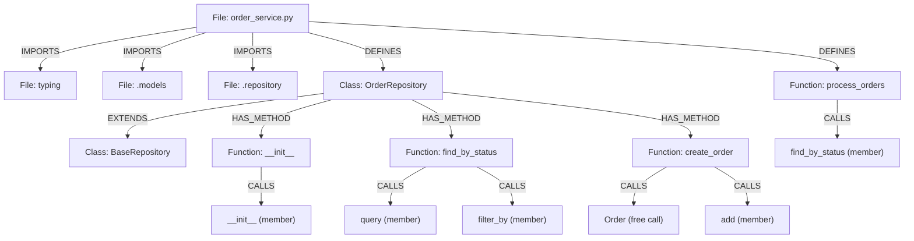

# Python Indexing

[<- Back to Code Indexing Overview](../README.md)

## Overview

- **Parser:** `tree-sitter-python`
- **File extensions:** `.py`, `.pyi`, `.pyw`
- **Special detection rules:** None. Stub files (`.pyi`) are parsed identically to regular `.py` files.

> Source: `gitnexus/src/core/ingestion/tree-sitter-queries.ts` -- `PYTHON_QUERIES`
> Language detection: `gitnexus/src/core/ingestion/utils.ts` -- `getLanguageFromFilename()`

---

## What Gets Extracted

### Definitions (-> Graph Nodes)

| AST Node Type | Capture Key | Graph Node Label | Example Code |
|---|---|---|---|
| `class_definition` | `@definition.class` | **Class** | `class UserRepository:` |
| `function_definition` | `@definition.function` | **Function** | `def process_payment(amount):` |

Python does not have separate `method_definition` nodes in tree-sitter. Methods inside classes are parsed as `function_definition` nodes nested inside `class_definition` bodies. GitNexus captures all of them as **Function** nodes, then uses `findEnclosingClassId()` to detect the enclosing class and emit a `HAS_METHOD` edge when applicable.

### Imports (-> IMPORTS edges)

| AST Pattern | What It Captures | Example |
|---|---|---|
| `import_statement` with `name: (dotted_name)` | Absolute module path | `import os.path` |
| `import_from_statement` with `module_name: (dotted_name)` | Absolute source module | `from collections import defaultdict` |
| `import_from_statement` with `module_name: (relative_import)` | Relative source module | `from .utils import helper` |

Three distinct import forms are handled:

1. **`import x`** -- the `dotted_name` captures the full module path (e.g., `os.path`).
2. **`from x import y`** -- the `dotted_name` captures the module (e.g., `collections`), not the imported name.
3. **`from .x import y`** -- the `relative_import` captures the relative path (e.g., `.utils`), including the leading dots.

Named bindings (the `y` in `from x import y`) are extracted separately during import resolution.

### Calls (-> CALLS edges)

| Call Form | AST Pattern | Example |
|---|---|---|
| Free function call | `call` > `function: (identifier)` | `len(items)` |
| Member/attribute call | `call` > `function: (attribute)` > `attribute: (identifier)` | `self.validate()` / `db.query()` |

Note that Python's tree-sitter grammar uses `call` (not `call_expression`) and `attribute` (not `member_expression`). Constructor calls in Python look like regular function calls (`User("alice")`) and are captured by the free function call pattern. The `new` keyword does not exist in Python.

Built-in names (`print`, `len`, `range`, `str`, `int`, `list`, `dict`, `set`, `tuple`, `super`, `isinstance`, etc.) are filtered by `isBuiltInOrNoise()` and do not produce CALLS edges.

### Inheritance (-> EXTENDS edges)

| AST Pattern | Edge Type | Example |
|---|---|---|
| `class_definition` > `superclasses: (argument_list)` > `(identifier)` | **EXTENDS** | `class Admin(User):` |

Python supports multiple inheritance. Each parent class in the `argument_list` generates a **separate EXTENDS edge**:

```python
class MultiChild(ParentA, ParentB, ParentC):
    pass
# Produces: MultiChild --EXTENDS--> ParentA
#           MultiChild --EXTENDS--> ParentB
#           MultiChild --EXTENDS--> ParentC
```

Python has no `implements` keyword or interface construct, so only EXTENDS edges are produced. Abstract base classes (ABCs) and protocol classes are treated as regular class inheritance.

---

## Annotated Example

```python
# file: src/services/order_service.py

from typing import List, Optional              # (1) IMPORTS -> typing
from .models import Order, OrderStatus         # (2) IMPORTS -> .models
from .repository import BaseRepository         # (3) IMPORTS -> .repository

class OrderRepository(BaseRepository):         # (4) Class node + EXTENDS -> BaseRepository

    def __init__(self, db_session):            # (5) Function node (method) + HAS_METHOD
        super().__init__(db_session)           # (6) CALLS -> __init__ (member call)

    def find_by_status(self, status):          # (7) Function node (method) + HAS_METHOD
        return self.session.query(Order).filter_by(status=status).all()
        #                        ^(8) CALLS -> query    ^(9) CALLS -> filter_by

    def create_order(self, data):              # (10) Function node (method) + HAS_METHOD
        order = Order(**data)                  # (11) CALLS -> Order (constructor-like)
        self.session.add(order)                # (12) CALLS -> add (member call)
        return order

def process_orders(repo: OrderRepository) -> List[Order]:  # (13) Function node (top-level)
    pending = repo.find_by_status(OrderStatus.PENDING)     # (14) CALLS -> find_by_status
    return pending
```

### Resulting Graph



---

## Extraction Details

### Tree-sitter Query Source

The full query string is defined as `PYTHON_QUERIES` in:

```
gitnexus/src/core/ingestion/tree-sitter-queries.ts  (lines 140-168)
```

It is selected via the `LANGUAGE_QUERIES` map keyed by `SupportedLanguages.Python`.

### Language-Specific Quirks and Limitations

1. **Methods are captured as Function, not Method.** Python's tree-sitter grammar uses `function_definition` for all functions, whether top-level or inside a class. GitNexus labels them all as **Function** nodes. The `HAS_METHOD` edge to the enclosing class is created by `findEnclosingClassId()`, which walks up the AST looking for a `class_definition` parent.

2. **Decorators are not directly captured.** Functions under `decorated_definition` nodes are still extracted because tree-sitter nests the `function_definition` inside the decorator wrapper. However, the decorator name itself (e.g., `@staticmethod`, `@app.route`) is not recorded as a graph node or relationship.

3. **No separate capture for `async def`.** Async functions use the same `function_definition` node type in tree-sitter-python (wrapped in an outer node). They are captured identically to synchronous functions.

4. **Constructor calls look like free calls.** `User("alice")` is syntactically identical to `len(items)` in Python's AST. Both are `call` > `function: (identifier)`. The call processor does not distinguish constructors from functions in Python -- both produce the same CALLS edge. Disambiguation happens during symbol resolution (Phase 3), where the target is matched to a Class node if one exists.

5. **Multiple inheritance produces multiple edges.** Each identifier in the superclass `argument_list` generates a separate EXTENDS edge. Keyword arguments in the base class list (e.g., `class Meta(metaclass=ABCMeta):`) have the `metaclass` argument captured as an identifier, but it is filtered during heritage resolution because it does not resolve to a known class symbol.

6. **`from __future__ import` statements** are captured as regular imports. The source module `__future__` is recorded.

7. **Star imports** (`from module import *`) capture the module name but not the individual names. The wildcard is not expanded.

8. **Nested classes and functions.** Inner `class_definition` or `function_definition` nodes are captured as separate graph nodes. A function defined inside another function produces two Function nodes, each with their own DEFINES edge from the file. The inner function does **not** get a HAS_METHOD edge (only class-enclosed functions do).

9. **Global and nonlocal** statements are not captured. Variable assignments at module scope are not indexed.

10. **Comprehensions and lambdas** are not captured as definitions. `lambda x: x + 1` does not produce a Function node. List/dict/set comprehensions are also not indexed.

---

## Node Type Matrix

| Graph Node Type | Produced by Python Indexing |
|---|---|
| Function | Yes (all `def` declarations, including methods) |
| Class | Yes |
| Interface | No (Python has no interface keyword) |
| Method | No (methods are captured as Function; see quirk #1) |
| Struct | No |
| Enum | No (enum classes are captured as Class) |
| Namespace | No |
| Module | No |
| Trait | No |
| Impl | No |
| TypeAlias | No |
| Const | No |
| Static | No |
| Typedef | No |
| Macro | No |
| Union | No |
| Property | No |
| Record | No |
| Delegate | No |
| Annotation | No |
| Constructor | No (`__init__` is captured as Function) |
| Template | No |
