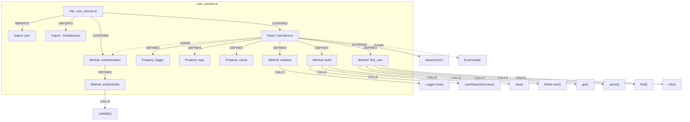
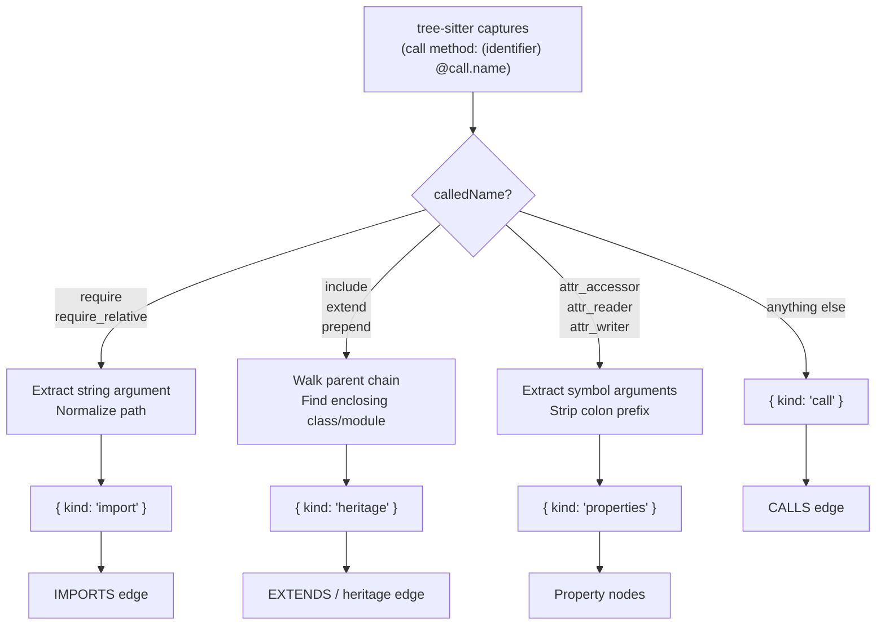

# Ruby Indexing

[← Back to Code Indexing Overview](../README.md)

## Overview

| Property | Value |
|----------|-------|
| **Parser** | tree-sitter-ruby |
| **Extensions** | `.rb`, `.rake`, `.gemspec` |
| **Query constant** | `RUBY_QUERIES` in `src/core/ingestion/tree-sitter-queries.ts` |
| **Call routing** | `routeRubyCall` in `src/core/ingestion/call-routing.ts` |

Ruby indexing is unique among GitNexus-supported languages because Ruby expresses imports, mixins, and property declarations as **method calls** rather than dedicated syntax. The tree-sitter queries capture a single broad `(call ...)` pattern, and a dedicated **call router** (`routeRubyCall`) classifies each call at extraction time into one of four semantic categories: import, heritage, property definition, or regular call.

## What Gets Extracted

### Definitions

| Ruby Construct | Capture | Graph Node Label |
|---------------|---------|------------------|
| `module Foo` | `definition.module` | `Module` |
| `class Foo` | `definition.class` | `Class` |
| `def foo` | `definition.method` | `Method` |
| `def self.foo` | `definition.method` | `Method` |
| `attr_accessor :name` | Routed from call | `Property` (via call routing) |
| `attr_reader :name` | Routed from call | `Property` (via call routing) |
| `attr_writer :name` | Routed from call | `Property` (via call routing) |

### Imports

Ruby has no `import` statement. Instead, `require` and `require_relative` are method calls:

```ruby
require 'json'                    # routed to import: 'json'
require_relative '../models/user' # routed to import: './models/user' (prefixed)
```

The call router detects these by name, extracts the string argument, and emits an `IMPORTS` edge. `require_relative` paths are normalized with a `./` prefix if missing.

### Calls

All other method calls are captured by the single `(call method: (identifier) @call.name)` pattern. After call routing filters out `require`, `include`, `extend`, `prepend`, `attr_accessor`, `attr_reader`, and `attr_writer`, the remaining calls produce `CALLS` edges.

A second pattern, `(body_statement (identifier) @call.name @call)`, captures bare identifiers at statement level. In Ruby, these are ambiguous -- they could be local variable references or zero-arity method calls. Post-processing with `isBuiltInOrNoise` filtering suppresses most false positives, but some may remain.

### Inheritance and Mixins

| Pattern | Example | Extraction Path |
|---------|---------|----------------|
| Class inheritance | `class Admin < User` | Tree-sitter heritage query |
| Module include | `include Comparable` | Call routing -> heritage |
| Module extend | `extend ClassMethods` | Call routing -> heritage |
| Module prepend | `prepend Logging` | Call routing -> heritage |

Class inheritance (`<`) is captured directly by the tree-sitter heritage query. Mixins (`include`, `extend`, `prepend`) are method calls that the call router detects and converts to heritage edges. The router walks the AST parent chain to find the enclosing class or module name.

## Annotated Example

Given the following Ruby file `user_service.rb`:

```ruby
require 'json'                         # [1] Call routed to import
require_relative '../models/user'      # [1] Call routed to import

module Authentication                  # [2] Module definition
  def authenticate(token)              # [3] Method definition
    validate(token)                    # [4] Regular call
  end
end

class UserService < BaseService        # [5] Class + [6] Heritage: extends BaseService
  include Authentication               # [7] Call routed to heritage (mixin)
  include Enumerable                   # [7] Call routed to heritage (mixin)

  attr_accessor :logger                # [8] Call routed to property: logger
  attr_reader :repo, :cache            # [8] Call routed to properties: repo, cache

  def initialize(repo, cache: nil)     # [3] Method definition
    @repo = repo
    @cache = cache
    @logger = Logger.new(STDOUT)       # [9] Navigation call: Logger.new
  end

  def self.build(config)               # [10] Singleton method definition
    repo = UserRepository.new(config)  # [9] Call: UserRepository.new
    new(repo, cache: Redis.new)        # [4] Call: new, [9] Call: Redis.new
  end

  def find_user(id)                    # [3] Method definition
    cached = cache.get(id)             # [4] Call: get
    return JSON.parse(cached) if cached # [4] Call: parse
    user = repo.find(id)              # [4] Call: find
    logger.info("Found user #{id}")   # [4] Call: info
    user
  end
end
```

The resulting knowledge graph fragment:



## Extraction Details

### Call Routing Architecture

Ruby is the only language in GitNexus that uses call routing. The `callRouters` dispatch table in `src/core/ingestion/call-routing.ts` maps each `SupportedLanguages` value to a router function. All languages except Ruby use the `noRouting` passthrough. Ruby uses `routeRubyCall`.

The routing decision flow:



### Bare Identifier Ambiguity

The query `(body_statement (identifier) @call.name @call)` captures identifiers at statement level. In Ruby, a bare identifier like `result` at statement level could be:

1. A local variable reference (reading its value, discarding it)
2. A zero-arity method call without parentheses

Tree-sitter-ruby cannot distinguish these cases at the grammar level. GitNexus captures them as potential calls and relies on post-processing (`isBuiltInOrNoise` filtering and symbol resolution) to suppress false positives. A variable name that coincidentally matches a method name defined elsewhere may still produce a false `CALLS` edge.

### Singleton Methods

Ruby's `def self.foo` syntax defines class-level methods. The grammar represents these as `singleton_method` nodes, which are captured with the same `definition.method` label as instance methods. Both produce `Method` nodes in the graph.

### `attr_*` Property Extraction

When the call router encounters `attr_accessor`, `attr_reader`, or `attr_writer`, it iterates over the argument list and extracts each `simple_symbol` argument:

```ruby
attr_accessor :name, :email   # produces Property nodes: "name", "email"
```

The leading colon (`:`) is stripped from the symbol name. Each property gets its own `Property` node with accurate `startLine`/`endLine` from the AST.

### Heritage: Parent Chain Walking

For `include`, `extend`, and `prepend`, the router must determine *which class or module* the mixin belongs to. It walks the `callNode.parent` chain up to `MAX_PARENT_DEPTH` (50) levels, looking for a `class` or `module` node. If no enclosing class/module is found (e.g., top-level `include`), the call is skipped.

### Scope Resolution in Mixins

Mixin arguments can be simple constants (`include Comparable`) or scope-resolved constants (`include ActiveModel::Validations`). The router captures both `constant` and `scope_resolution` node types from the argument list, preserving the full qualified name.

## Node Type Matrix

| `definition.*` Capture | Graph Label | Ruby Constructs |
|------------------------|-------------|-----------------|
| `definition.module` | `Module` | `module Foo` |
| `definition.class` | `Class` | `class Foo` |
| `definition.method` | `Method` | `def foo`, `def self.foo` |
| *(via call routing)* | `Property` | `attr_accessor :x`, `attr_reader :x`, `attr_writer :x` |
| *(via call routing)* | *(import edge)* | `require 'x'`, `require_relative 'x'` |
| *(via call routing)* | *(heritage edge)* | `include Mod`, `extend Mod`, `prepend Mod` |
