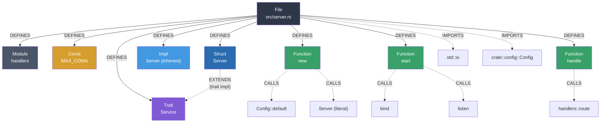

# Rust Indexing

[← Back to Code Indexing Overview](../README.md)

## Overview

GitNexus indexes Rust source files (`.rs`) using **tree-sitter-rust**. Rust produces the most diverse set of graph node types of any supported language -- 10 distinct types from a single file. The extraction captures Rust's ownership-oriented type system including traits, impl blocks (both inherent and trait implementations), modules, macros, constants, statics, and type aliases. The heritage queries handle all four combinations of concrete and generic types in trait implementations.

| Property | Value |
|----------|-------|
| Parser | `tree-sitter-rust` |
| Extensions | `.rs` |
| Query constant | `RUST_QUERIES` |
| Node types | Function, Struct, Enum, Trait, Impl, Module, TypeAlias, Const, Static, Macro |

## What Gets Extracted

### Definitions (Graph Nodes)

Each captured definition becomes a node in the knowledge graph with a `DEFINES` edge from the enclosing `File` node.

| Rust Construct | Query Pattern | Graph Node Label |
|---------------|--------------|-----------------|
| `fn process()` | `function_item` | **Function** |
| `struct User { ... }` | `struct_item` | **Struct** |
| `enum Color { ... }` | `enum_item` | **Enum** |
| `trait Drawable { ... }` | `trait_item` | **Trait** |
| `impl User { ... }` (inherent) | `impl_item` with `!trait` | **Impl** |
| `impl<T> Vec<T> { ... }` (generic inherent) | `impl_item` with `generic_type` + `!trait` | **Impl** |
| `mod utils { ... }` | `mod_item` | **Module** |
| `type Result<T> = ...` | `type_item` | **TypeAlias** |
| `const MAX: u32 = 100;` | `const_item` | **Const** |
| `static GLOBAL: Mutex<i32> = ...` | `static_item` | **Static** |
| `macro_rules! vec { ... }` | `macro_definition` | **Macro** |

**Key design decision:** Inherent impl blocks (`impl Foo { ... }`) are distinguished from trait impl blocks (`impl Bar for Foo { ... }`) using tree-sitter's `!trait` negation operator. Only inherent impls produce `Impl` nodes. Trait impls produce heritage edges instead.

### Imports (IMPORTS edges)

Rust `use` declarations are captured with a single, flexible pattern:

| Rust Syntax | Query Pattern |
|-------------|--------------|
| `use std::collections::HashMap;` | `use_declaration` with `argument: (_)` |
| `use crate::utils::*;` | Same pattern (glob re-exports) |
| `use super::parent_mod;` | Same pattern (relative paths) |
| `use std::{io, fs};` | Same pattern (grouped imports) |

The wildcard `(_)` on `argument` captures any use-path form: simple paths, glob imports, grouped imports, and aliased imports (`use foo as bar`). The linking phase parses the captured text to resolve individual targets.

### Calls (CALLS edges)

| Rust Syntax | Query Pattern | What is captured |
|-------------|--------------|-----------------|
| `process(data)` | `call_expression` with `identifier` | Direct function call |
| `self.validate()` | `call_expression` with `field_expression` | Method call via field |
| `Vec::new()` | `call_expression` with `scoped_identifier` | Scoped (path-qualified) call |
| `collect::<Vec<_>>()` | `call_expression` with `generic_function` | Generic turbofish call |
| `User { name: val }` | `struct_expression` with `type_identifier` | Struct literal construction |

The four call patterns cover Rust's varied calling conventions:

1. **Direct calls** -- bare function name: `process(data)`
2. **Field calls** -- method calls on self/fields: `self.run()`, `server.start()`
3. **Scoped calls** -- path-qualified: `HashMap::new()`, `io::stdin()`
4. **Generic calls** -- turbofish syntax: `iter.collect::<Vec<_>>()`

Struct literal construction (`User { name: "Alice" }`) is captured as a constructor-like call because it creates a dependency on the struct type.

### Inheritance (EXTENDS edges via trait implementations)

Rust has no class inheritance. Instead, trait implementations (`impl Trait for Type`) define the type-to-trait relationship. The queries handle all four combinations of concrete and generic types:

| Rust Syntax | Trait form | Type form | Edge |
|-------------|-----------|----------|------|
| `impl Display for User` | concrete | concrete | User **EXTENDS** Display |
| `impl<T> Display for Vec<T>` | concrete | generic | Vec **EXTENDS** Display |
| `impl Iterator<Item=i32> for Counter` | generic | concrete | Counter **EXTENDS** Iterator |
| `impl<T> From<T> for MyBox<T>` | generic | generic | MyBox **EXTENDS** From |

Each combination requires a separate query pattern because `type_identifier` and `generic_type` are distinct AST nodes:

```
; concrete trait, concrete type
(impl_item trait: (type_identifier) @heritage.trait type: (type_identifier) @heritage.class)

; generic trait, concrete type
(impl_item trait: (generic_type type: (type_identifier) @heritage.trait) type: (type_identifier) @heritage.class)

; concrete trait, generic type
(impl_item trait: (type_identifier) @heritage.trait type: (generic_type type: (type_identifier) @heritage.class))

; generic trait, generic type
(impl_item trait: (generic_type type: (type_identifier) @heritage.trait) type: (generic_type type: (type_identifier) @heritage.class))
```

> **Note:** The heritage queries use `@heritage.trait` rather than `@heritage.extends` because Rust's `impl Trait for Type` semantics are closer to "Type implements Trait" than "Type extends Trait." The linking phase maps both to `EXTENDS` edges.

## Annotated Example

Consider the following Rust file `src/server.rs`:

```rust
use std::io;                                   // (1) import
use crate::config::Config;                     // (2) import

mod handlers;                                  // (3) module declaration

const MAX_CONN: u32 = 1024;                    // (4) constant

pub trait Service {                            // (5) trait
    fn handle(&self, req: Request) -> Response;
}

pub struct Server {                            // (6) struct
    port: u16,
    config: Config,
}

impl Server {                                  // (7) inherent impl
    pub fn new(port: u16) -> Self {            // (8) function in impl
        let cfg = Config::default();           // (9) scoped call
        Server { port, config: cfg }           // (10) struct literal
    }

    pub fn start(&self) -> io::Result<()> {    // (11) function in impl
        self.bind()?;                          // (12) field call
        listen(self.port)                      // (13) direct call
    }
}

impl Service for Server {                      // (14) trait impl -> heritage
    fn handle(&self, req: Request) -> Response {
        handlers::route(req)                   // (15) scoped call
    }
}
```

The extraction pipeline produces the following graph:



**Solid edges** represent in-file relationships established during parsing. **Dashed edges** are resolved during the cross-file linking phase. Note how the inherent `impl Server` block produces an **Impl** node, while the trait implementation `impl Service for Server` produces an **EXTENDS** edge from `Server` to `Service` with no separate Impl node.

## Extraction Details

### Inherent Impl vs. Trait Impl

This is the most important Rust-specific distinction in the extraction. The `!trait` negation operator in tree-sitter queries allows separating the two forms:

```
; Inherent impl -- produces an Impl node
(impl_item type: (type_identifier) @name !trait) @definition.impl

; Trait impl -- produces an EXTENDS edge, no Impl node
(impl_item trait: (type_identifier) @heritage.trait
           type: (type_identifier) @heritage.class) @heritage
```

The `!trait` field negation means "match only when the `trait` field is absent." This ensures `impl Server { }` matches the definition query while `impl Service for Server { }` matches only the heritage query.

For generic types, a parallel pair of queries handles `impl<T> Vec<T> { }` via `generic_type`:

```
(impl_item type: (generic_type type: (type_identifier) @name) !trait) @definition.impl
```

### Functions Inside Impl Blocks

Functions declared inside both inherent and trait impl blocks use `function_item` in tree-sitter-rust (not `method_declaration` as in some other languages). They are captured as **Function** nodes:

```rust
impl Server {
    pub fn new(port: u16) -> Self { ... }   // function_item -> Function
    pub fn start(&self) { ... }             // function_item -> Function
}
```

The `HAS_METHOD` edge linking these functions to their parent type is established by the enclosing-class detection in the parsing processor, which walks up the AST from the function node to find the nearest `impl_item`.

### Module Declarations

Rust `mod` items can be inline (`mod foo { ... }`) or external (`mod foo;`). Both produce the same AST node and are captured as **Module** nodes:

```rust
mod inline_mod {        // Module node -- contents parsed from this file
    fn helper() { }
}

mod external_mod;       // Module node -- contents in external_mod.rs or external_mod/mod.rs
```

External module declarations act as forward references. The actual file resolution happens at the filesystem level during GitNexus's file scanning, not in the tree-sitter queries.

### Macros

Only `macro_rules!` definitions are captured (as **Macro** nodes). Declarative macro invocations (`vec![1, 2, 3]`) are not captured as calls because they use `macro_invocation` nodes, which are syntactically distinct from `call_expression`. Procedural macros (`#[derive(Debug)]`) are attribute nodes, also not captured as calls.

```rust
macro_rules! my_vec {   // Macro node captured
    ($($x:expr),*) => { ... };
}

my_vec![1, 2, 3];      // NOT captured as a call (macro_invocation, not call_expression)
```

This is a known coverage gap. Macro invocation tracking would require additional query patterns targeting `macro_invocation` nodes.

### Scoped Calls and Turbofish

Rust's path-qualified calls and turbofish syntax are two of the more unusual call forms:

```rust
HashMap::new()           // scoped_identifier -> captures "new"
iter.collect::<Vec<_>>() // generic_function  -> captures "collect"
```

For scoped calls, only the final segment (`new`) is captured as `@call.name`. The qualifying path (`HashMap`) provides context but is not separately stored in the call capture. The linking phase uses the symbol table to resolve `new` to `HashMap::new` when possible.

For turbofish calls, the `generic_function` pattern strips the type parameters and captures the base function name (`collect`).

### Type Aliases, Constants, and Statics

These three item types produce dedicated node labels:

| Rust item | Node label | Typical use |
|-----------|-----------|------------|
| `type Result<T> = std::result::Result<T, MyError>;` | **TypeAlias** | Shorthand for complex types |
| `const MAX: u32 = 100;` | **Const** | Compile-time constants |
| `static COUNTER: AtomicU32 = AtomicU32::new(0);` | **Static** | Global mutable/immutable state |

These are not present in most other supported languages (TypeScript/Python have no direct equivalent of `static` items) and are unique to Rust's item-based module system.

## Node Type Matrix

| Definition Capture Key | Graph Node Label | Multiple per file? | Description |
|----------------------|-----------------|-------------------|-------------|
| `definition.function` | Function | Yes | Free functions and functions inside impl blocks |
| `definition.struct` | Struct | Yes | Named struct types |
| `definition.enum` | Enum | Yes | Sum types with variants |
| `definition.trait` | Trait | Yes | Trait definitions (interface equivalent) |
| `definition.impl` | Impl | Yes | Inherent impl blocks only (not trait impls) |
| `definition.module` | Module | Yes | Inline or external `mod` declarations |
| `definition.type` | TypeAlias | Yes | `type Foo = Bar` aliases |
| `definition.const` | Const | Yes | `const` items |
| `definition.static` | Static | Yes | `static` items |
| `definition.macro` | Macro | Yes | `macro_rules!` definitions |
