# Swift Indexing

[← Back to Code Indexing Overview](../README.md)

## Overview

| Property | Value |
|----------|-------|
| **Parser** | tree-sitter-swift |
| **Extensions** | `.swift` |
| **Query constant** | `SWIFT_QUERIES` in `src/core/ingestion/tree-sitter-queries.ts` |
| **Call routing** | None (passthrough) |

GitNexus indexes Swift source files using tree-sitter-swift. Like the Kotlin grammar, tree-sitter-swift models multiple distinct type declarations under a single node type: `class_declaration` serves as the AST node for classes, structs, enums, extensions, and actors. The specific kind is determined by an anonymous keyword child (`"class"`, `"struct"`, `"enum"`, `"extension"`, `"actor"`). Protocols, however, get their own dedicated `protocol_declaration` node type.

## What Gets Extracted

### Definitions

| Swift Construct | Capture | Graph Node Label |
|----------------|---------|------------------|
| `class Foo` | `definition.class` | `Class` |
| `struct Foo` | `definition.struct` | `Struct` |
| `enum Foo` | `definition.enum` | `Enum` |
| `extension Foo` | `definition.class` | `Class` |
| `actor Foo` | `definition.class` | `Class` |
| `protocol Foo` | `definition.interface` | `Interface` |
| `typealias Alias = Type` | `definition.type` | `TypeAlias` |
| `func foo()` | `definition.function` | `Function` |
| `func foo()` (in protocol) | `definition.method` | `Method` |
| `init(...)` | `definition.constructor` | `Constructor` |
| `var x` / `let x` | `definition.property` | `Property` |

### Imports

```swift
import Foundation       // captured: "Foundation"
import UIKit            // captured: "UIKit"
```

Each `import_declaration` is captured with the `simple_identifier` inside the `identifier` child as `@import.source`. The import processor resolves these to `IMPORTS` edges.

### Calls

| Pattern | Example | Capture Target |
|---------|---------|---------------|
| Direct call | `print("hello")` | `call_expression > simple_identifier` |
| Navigation call | `view.addSubview(child)` | `call_expression > navigation_expression > navigation_suffix > simple_identifier` |

Both patterns produce `CALLS` edges. Note that Swift constructor calls like `UserService()` look syntactically identical to function calls and are captured by the direct call pattern.

### Inheritance and Protocol Conformance

| Pattern | Example | Heritage Capture |
|---------|---------|-----------------|
| Class inheritance | `class Foo: Bar` | `class_declaration > inheritance_specifier` |
| Struct conformance | `struct Foo: Codable` | `class_declaration > inheritance_specifier` |
| Protocol inheritance | `protocol Foo: Bar` | `protocol_declaration > inheritance_specifier` |
| Extension conformance | `extension Foo: Hashable` | `class_declaration "extension" > inheritance_specifier` |

All produce `EXTENDS` edges. Extension protocol conformance uses a special query variant because the extension's type name is wrapped in `user_type` rather than being a bare `type_identifier`.

## Annotated Example

Given the following Swift file `UserService.swift`:

```swift
import Foundation                          // [1] Import
import Combine                             // [1] Import

protocol Identifiable {                    // [2] Protocol -> Interface node
    func getId() -> String                 // [3] Protocol function -> Method node
}

typealias UserID = String                  // [4] Type alias -> TypeAlias node

struct UserDTO: Codable {                  // [5] Struct + [6] Heritage: Codable
    let name: String                       // [7] Property
    let email: String                      // [7] Property
}

enum UserRole {                            // [8] Enum
    case admin
    case editor
    case viewer
}

class UserService: BaseService,            // [9] Class + [10] Heritage: BaseService
                   Identifiable {          //            + [10] Heritage: Identifiable

    var logger: Logger                     // [7] Property
    let repository: UserRepository         // [7] Property

    init(repository: UserRepository) {     // [11] Constructor (no name captured)
        self.repository = repository
        self.logger = Logger()             // [12] Call: Logger
        super.init()                       // [12] Call: init
    }

    func getId() -> String {              // [13] Function
        return "user-service"
    }

    func findUser(id: UserID) -> User? {  // [13] Function
        let cached = cache.get(id)        // [14] Navigation call: get
        guard let user = repository
            .find(byId: id) else {        // [14] Navigation call: find
            print("User not found")       // [12] Direct call: print
            return nil
        }
        return user
    }
}

extension UserService: CustomStringConvertible { // [15] Extension + [16] Heritage
    var description: String {              // [7] Property (computed)
        return "UserService(\(getId()))"   // [12] Call: getId
    }
}

actor TokenCache {                         // [17] Actor -> Class node
    private var tokens: [String: String] = [:] // [7] Property

    func store(key: String, token: String) {   // [13] Function
        tokens[key] = token
    }
}
```

The resulting knowledge graph fragment:

```mermaid
graph TD
    subgraph "UserService.swift"
        FILE[File: UserService.swift]

        IMP_FND[Import: Foundation]
        IMP_CMB[Import: Combine]

        PROTO[Interface: Identifiable]
        PROTO_M[Method: getId]
        TA[TypeAlias: UserID]
        DTO[Struct: UserDTO]
        DTO_NAME[Property: name]
        DTO_EMAIL[Property: email]
        ROLE[Enum: UserRole]

        CLS[Class: UserService]
        P_LOG[Property: logger]
        P_REPO[Property: repository]
        CTOR[Constructor: init]
        F_GETID[Function: getId]
        F_FIND[Function: findUser]

        EXT[Class: UserService_ext]
        EXT_DESC[Property: description]

        ACTOR[Class: TokenCache]
        ACTOR_TOK[Property: tokens]
        ACTOR_STORE[Function: store]
    end

    FILE -->|IMPORTS| IMP_FND
    FILE -->|IMPORTS| IMP_CMB

    FILE -->|CONTAINS| PROTO
    FILE -->|CONTAINS| TA
    FILE -->|CONTAINS| DTO
    FILE -->|CONTAINS| ROLE
    FILE -->|CONTAINS| CLS
    FILE -->|CONTAINS| EXT
    FILE -->|CONTAINS| ACTOR

    PROTO -->|DEFINES| PROTO_M

    DTO -->|EXTENDS| CODABLE[Codable]
    DTO -->|DEFINES| DTO_NAME
    DTO -->|DEFINES| DTO_EMAIL

    CLS -->|EXTENDS| BASE[BaseService]
    CLS -->|EXTENDS| PROTO
    CLS -->|DEFINES| P_LOG
    CLS -->|DEFINES| P_REPO
    CLS -->|DEFINES| CTOR
    CLS -->|DEFINES| F_GETID
    CLS -->|DEFINES| F_FIND

    CTOR -->|CALLS| LOGGER_CALL["Logger()"]
    CTOR -->|CALLS| INIT_CALL["init()"]
    F_FIND -->|CALLS| GET_CALL["get()"]
    F_FIND -->|CALLS| FIND_CALL["find()"]
    F_FIND -->|CALLS| PRINT_CALL["print()"]

    EXT -->|EXTENDS| CSC[CustomStringConvertible]
    EXT -->|DEFINES| EXT_DESC
    EXT_DESC -->|CALLS| GETID_CALL2["getId()"]

    ACTOR -->|DEFINES| ACTOR_TOK
    ACTOR -->|DEFINES| ACTOR_STORE
```



## Extraction Details

### Grammar Quirk: `class_declaration` for Everything

tree-sitter-swift uses `class_declaration` as the AST node for five different Swift constructs:

| Swift Keyword | Anonymous Keyword Child | Mapped Label |
|--------------|------------------------|--------------|
| `class` | `"class"` | `Class` |
| `struct` | `"struct"` | `Struct` |
| `enum` | `"enum"` | `Enum` |
| `extension` | `"extension"` | `Class` |
| `actor` | `"actor"` | `Class` |

Only `protocol` has its own dedicated node type (`protocol_declaration`), mapped to `Interface`.

Extensions and actors are both mapped to `Class` because the graph schema does not have dedicated `Extension` or `Actor` labels. This means an `extension Foo` node and the original `class Foo` node will have the same graph label but different IDs (they are in the same file or different files, with distinct start lines).

### Extension Name Wrapping

When a `class_declaration` has the `"extension"` keyword child, the type name is wrapped in `user_type`:

```
(class_declaration "extension" name: (user_type (type_identifier) @name))
```

For all other keywords (`class`, `struct`, `enum`, `actor`), the name is a bare `type_identifier`:

```
(class_declaration "class" name: (type_identifier) @name)
```

This difference also affects heritage queries: the extension heritage query must capture the class name through `user_type`.

### Initializers (Constructors)

Swift initializers are captured as `Constructor` nodes:

```scheme
(init_declaration) @definition.constructor
```

No `@name` is captured because `init` has no explicit name child in the AST. The parsing processor synthesizes the name `"init"` for constructors that lack a captured `@name`:

```typescript
// In parsing-processor.ts
if (!nameNode && !captureMap['definition.constructor']) return;
const nodeName = nameNode ? nameNode.text : 'init';
```

This means all Swift initializers appear as `Constructor` nodes named `init` in the graph.

### Protocol Functions vs Regular Functions

Swift has two distinct function declaration types:

- `function_declaration` -- used for top-level functions, methods in classes/structs/enums, and extension methods. Captured as `Function`.
- `protocol_function_declaration` -- used for method signatures inside protocol bodies. Captured as `Method`.

This distinction allows the graph to differentiate between a protocol's method *requirement* (`Method` node) and a conforming type's method *implementation* (`Function` node).

### Heritage for Extensions

Extension protocol conformance (e.g., `extension Foo: Hashable`) requires a dedicated heritage query because the type name is inside `user_type`:

```scheme
(class_declaration "extension"
  name: (user_type (type_identifier) @heritage.class)
  (inheritance_specifier
    inherits_from: (user_type (type_identifier) @heritage.extends))) @heritage
```

This is separate from the standard class/struct heritage query and from the protocol inheritance query. Without it, extension conformances would be silently missed.

### What Is Not Captured

- **Closures**: Unnamed closures (`{ param in ... }`) are not captured as definitions.
- **Subscripts**: `subscript(index: Int)` declarations are not captured.
- **Deinitializers**: `deinit { ... }` blocks are not captured.
- **Operator declarations**: `func +(lhs: T, rhs: T) -> T` operator overloads are captured as `Function` nodes, but the operator symbol name may not resolve cleanly.
- **`@objc` / `@available` attributes**: Not extracted (framework detection handles some attribute-level hints separately).
- **Conditional compilation**: `#if`, `#else`, `#endif` blocks are parsed by tree-sitter but all branches are extracted, regardless of platform conditions.

## Node Type Matrix

| `definition.*` Capture | Graph Label | Swift Constructs |
|------------------------|-------------|------------------|
| `definition.class` | `Class` | `class Foo`, `extension Foo`, `actor Foo` |
| `definition.struct` | `Struct` | `struct Foo` |
| `definition.enum` | `Enum` | `enum Foo` |
| `definition.interface` | `Interface` | `protocol Foo` |
| `definition.type` | `TypeAlias` | `typealias Alias = Type` |
| `definition.function` | `Function` | `func foo()` (top-level, class/struct/enum/extension methods) |
| `definition.method` | `Method` | `func foo()` (inside `protocol` body only) |
| `definition.constructor` | `Constructor` | `init(...)` (name synthesized as `"init"`) |
| `definition.property` | `Property` | `var x`, `let x` (stored and computed) |
