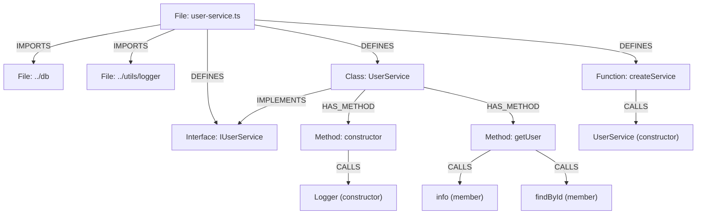

# TypeScript Indexing

[<- Back to Code Indexing Overview](../README.md)

## Overview

- **Parser:** `tree-sitter-typescript` (standard `.ts` files) and `tree-sitter-typescript/tsx` (`.tsx` files)
- **File extensions:** `.ts`, `.tsx`, `.mts`, `.cts`
- **Special detection rules:** `.tsx` files use the separate TSX grammar variant, which adds JSX expression support. Both variants share the same query set (`TYPESCRIPT_QUERIES`).

> Source: `gitnexus/src/core/ingestion/tree-sitter-queries.ts` -- `TYPESCRIPT_QUERIES`
> Language detection: `gitnexus/src/core/ingestion/utils.ts` -- `getLanguageFromFilename()`

---

## What Gets Extracted

### Definitions (-> Graph Nodes)

| AST Node Type | Capture Key | Graph Node Label | Example Code |
|---|---|---|---|
| `class_declaration` | `@definition.class` | **Class** | `class UserService { }` |
| `interface_declaration` | `@definition.interface` | **Interface** | `interface IUser { name: string }` |
| `function_declaration` | `@definition.function` | **Function** | `function parseConfig() { }` |
| `method_definition` | `@definition.method` | **Method** | `getData(): string { }` (inside class) |
| `lexical_declaration` > `variable_declarator` > `arrow_function` | `@definition.function` | **Function** | `const fetchUser = () => { }` |
| `lexical_declaration` > `variable_declarator` > `function_expression` | `@definition.function` | **Function** | `const fetchUser = function() { }` |
| `export_statement` > `lexical_declaration` > `arrow_function` | `@definition.function` | **Function** | `export const fetchUser = () => { }` |
| `export_statement` > `lexical_declaration` > `function_expression` | `@definition.function` | **Function** | `export const fetchUser = function() { }` |

### Imports (-> IMPORTS edges)

| AST Pattern | What It Captures | Example |
|---|---|---|
| `import_statement` with `source: (string)` | Module specifier string | `import { Foo } from './foo'` |
| `export_statement` with `source: (string)` | Re-export source | `export { Bar } from './bar'` |

The `@import.source` capture extracts the string literal (e.g., `'./foo'`). Named bindings (`{ Foo, Bar as Baz }`) are extracted separately by `named-binding-extraction.ts` during import resolution. Re-exports (`export { X } from './y'`) are treated as imports so the IMPORTS edge is created between the re-exporting file and the source file.

### Calls (-> CALLS edges)

| Call Form | AST Pattern | Example |
|---|---|---|
| Free function call | `call_expression` > `function: (identifier)` | `parseConfig()` |
| Member/method call | `call_expression` > `function: (member_expression)` > `property: (property_identifier)` | `this.validate()` / `user.save()` |
| Constructor call | `new_expression` > `constructor: (identifier)` | `new UserService()` |

Call form discrimination (`free` / `member` / `constructor`) is performed post-capture by `inferCallForm()` in `utils.ts`, which inspects the AST structure around the captured `@call.name` node. Built-in names (e.g., `console`, `log`, `map`, `filter`, `JSON`, `Promise`) are filtered by `isBuiltInOrNoise()` and do not produce CALLS edges.

### Inheritance (-> EXTENDS / IMPLEMENTS edges)

| AST Pattern | Edge Type | Example |
|---|---|---|
| `class_declaration` > `class_heritage` > `extends_clause` > `value: (identifier)` | **EXTENDS** | `class Admin extends User { }` |
| `class_declaration` > `class_heritage` > `implements_clause` > `(type_identifier)` | **IMPLEMENTS** | `class UserService implements IService { }` |

Heritage resolution uses the symbol table first (authoritative). If the parent symbol is registered as an `Interface`, an IMPLEMENTS edge is emitted; otherwise EXTENDS. For unresolved external symbols, TypeScript defaults to EXTENDS.

---

## Annotated Example

```typescript
// file: src/services/user-service.ts

import { Database } from '../db';              // (1) IMPORTS edge -> ../db
import { Logger } from '../utils/logger';      // (2) IMPORTS edge -> ../utils/logger

interface IUserService {                        // (3) Interface node
  getUser(id: string): Promise<User>;
}

class UserService implements IUserService {     // (4) Class node + IMPLEMENTS -> IUserService
  private logger: Logger;

  constructor() {                               // (5) Method node (constructor)
    this.logger = new Logger();                 // (6) CALLS -> Logger (constructor)
  }

  async getUser(id: string): Promise<User> {   // (7) Method node
    this.logger.info('fetching');               // (8) CALLS -> info (member call)
    return Database.findById(id);               // (9) CALLS -> findById (member call)
  }
}

export const createService = (): UserService => { // (10) Function node (arrow fn)
  return new UserService();                        // (11) CALLS -> UserService (constructor)
};
```

### Resulting Graph



---

## Extraction Details

### Tree-sitter Query Source

The full query string is defined as `TYPESCRIPT_QUERIES` in:

```
gitnexus/src/core/ingestion/tree-sitter-queries.ts  (lines 12-78)
```

It is selected via the `LANGUAGE_QUERIES` map keyed by `SupportedLanguages.TypeScript`.

### Language-Specific Quirks and Limitations

1. **Arrow functions and function expressions** are only captured when assigned via `const`/`let` (`lexical_declaration`). A bare arrow function passed as a callback argument (e.g., `arr.map((x) => x + 1)`) is not captured as a definition -- only the `map` call is recorded.

2. **Exported arrow functions** require a separate query pattern (`export_statement` wrapping `lexical_declaration`). Without this, `export const foo = () => {}` would only be captured by the non-exported variant, but the node range would be wrong (missing the `export` keyword).

3. **TSX vs TS grammar:** `.tsx` files are parsed with `tree-sitter-typescript/tsx`, which extends the TypeScript grammar with JSX expression support. The same `TYPESCRIPT_QUERIES` are used for both grammars. JSX elements themselves are not captured as definitions or calls.

4. **Re-exports as imports:** `export { X } from './y'` is captured by the same `@import` pattern as regular imports. This ensures transitive dependencies are tracked even when a barrel file re-exports symbols.

5. **Class names use `type_identifier`** in the TypeScript grammar (not `identifier`). This is distinct from JavaScript, where class names are plain `identifier` nodes. Heritage captures also use `type_identifier` for the class being declared and `identifier` for the parent in extends clauses.

6. **Method signatures:** For Method and Function nodes, `extractMethodSignature()` extracts `parameterCount` and `returnType` from the AST. Rest parameters (`...args`) set `parameterCount` to `undefined` (variadic).

7. **Export detection:** `isNodeExported()` checks whether a definition has an `export` keyword ancestor, and stores the result as `isExported: true/false` on the graph node.

8. **Enclosing class linkage:** Methods and constructors inside a class body receive a `HAS_METHOD` edge from the enclosing Class node. This is determined by `findEnclosingClassId()`, which walks up the AST looking for `class_declaration` parents.

---

## Node Type Matrix

| Graph Node Type | Produced by TypeScript Indexing |
|---|---|
| Function | Yes (declarations, arrow functions, function expressions) |
| Class | Yes |
| Interface | Yes |
| Method | Yes |
| Struct | No |
| Enum | No |
| Namespace | No |
| Module | No |
| Trait | No |
| Impl | No |
| TypeAlias | No |
| Const | No |
| Static | No |
| Typedef | No |
| Macro | No |
| Union | No |
| Property | No |
| Record | No |
| Delegate | No |
| Annotation | No |
| Constructor | No (constructors are captured as Method via `method_definition`) |
| Template | No |
