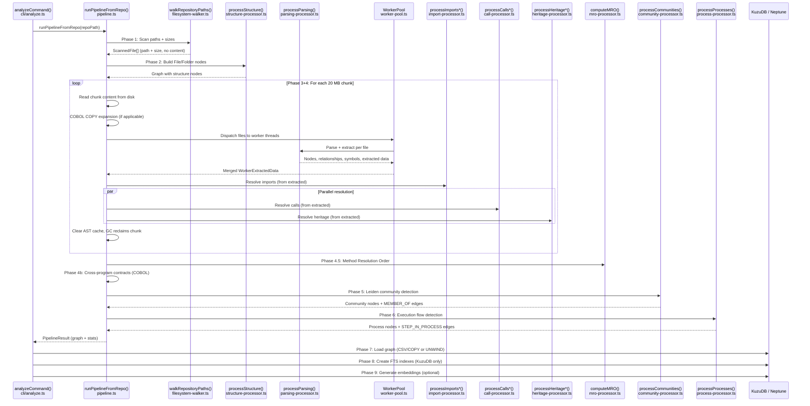
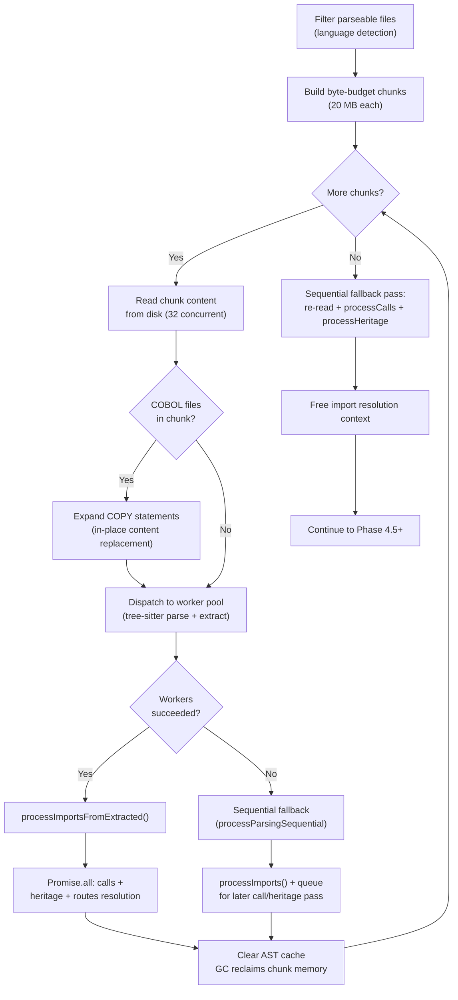
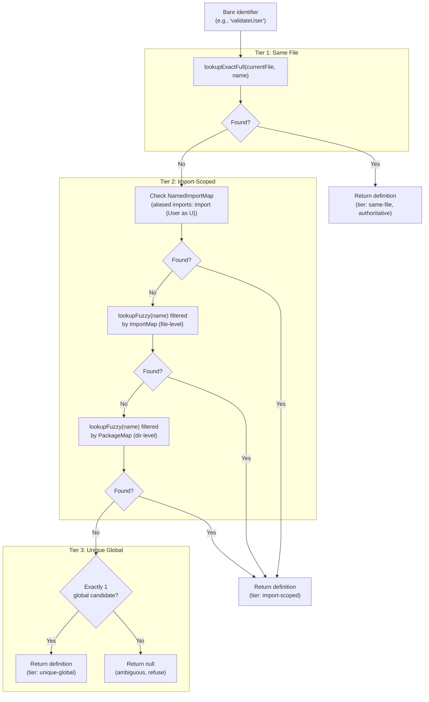

# Pipeline Architecture

[Back to README](../../README.md)

## Overview

The GitNexus indexing pipeline transforms a source code repository into a queryable knowledge graph. Starting from a CLI command (`gitnexus analyze`), the pipeline scans files, parses source code across 14+ languages, extracts symbols and relationships, clusters code into communities, detects execution flows, and loads everything into a graph database (KuzuDB or AWS Neptune).

The pipeline is designed for codebases ranging from small TypeScript projects to million-line COBOL monoliths. Its core architectural principle is **chunked, streaming processing**: source files are grouped into 20 MB byte-budget chunks so that only one chunk's worth of content, ASTs, and extracted records live in memory at a time. This keeps peak memory bounded at roughly 200-400 MB per chunk regardless of total repository size.

The entry point is `analyzeCommand()` in the CLI, which delegates graph construction to `runPipelineFromRepo()`, then handles database loading, full-text search indexing, and optional embedding generation as post-pipeline phases.

## End-to-End Sequence

The following diagram shows the full flow from CLI invocation to a queryable graph database.



## Pipeline Stages

### Phase 1: File Scanning

| | |
|---|---|
| **Function** | `walkRepositoryPaths()` |
| **Source** | `gitnexus/src/core/ingestion/filesystem-walker.ts` |
| **Input** | Repository root path (`string`) |
| **Output** | `ScannedFile[]` (each entry: `{ path: string; size: number }`) |

Scans the repository using glob (`**/*`), filters paths through the ignore service (`.gitignore` patterns, `node_modules`, etc.), then stats each file in batches of 32 concurrent `fs.stat()` calls to collect sizes. No file content is read at this stage.

**Performance:** ~10 MB heap for 100K files (paths + sizes only). Avoids the ~1 GB+ cost of loading all content upfront. The sizes are used in Phase 3 to build byte-budget chunks.

### Phase 2: Structure Analysis

| | |
|---|---|
| **Function** | `processStructure()` |
| **Source** | `gitnexus/src/core/ingestion/structure-processor.ts` |
| **Input** | `string[]` (file paths from Phase 1) |
| **Output** | `File` and `Folder` nodes + `CONTAINS` edges in the graph |

Iterates every path, splits on `/`, and creates `Folder` nodes for each directory segment and a `File` node for the terminal segment. Emits `CONTAINS` edges from parent folder to child. This phase requires no file content -- only the path strings from Phase 1.

### Phase 3+4: Chunked Parse and Resolve

| | |
|---|---|
| **Functions** | `runPipelineFromRepo()` (orchestration), `processParsing()`, `processImportsFromExtracted()`, `processCallsFromExtracted()`, `processHeritageFromExtracted()`, `processRoutesFromExtracted()` |
| **Source** | `gitnexus/src/core/ingestion/pipeline.ts`, `gitnexus/src/core/ingestion/parsing-processor.ts`, `gitnexus/src/core/ingestion/import-processor.ts`, `gitnexus/src/core/ingestion/call-processor.ts`, `gitnexus/src/core/ingestion/heritage-processor.ts` |
| **Input** | `ScannedFile[]` filtered to parseable languages |
| **Output** | Symbol nodes (Function, Class, Method, Interface, ...), `DEFINES`, `IMPORTS`, `CALLS`, `EXTENDS`, `IMPLEMENTS` edges |

This is the largest and most complex phase. It is subdivided into chunking, parsing, and relationship resolution.

#### Chunking

Parseable files are grouped into byte-budget chunks of 20 MB (`CHUNK_BYTE_BUDGET`). Each chunk is processed sequentially: read content from disk, parse, extract, resolve, then free memory before the next chunk. This keeps peak working memory at ~200-400 MB per chunk (source + ASTs + extracted records + worker serialization overhead).

```
CHUNK_BYTE_BUDGET = 20 * 1024 * 1024  // 20 MB of source per chunk
```

For a 224 MB codebase (e.g., EPAGHE COBOL), this produces approximately 12 chunks.

#### Parsing (Worker Pool)

Each chunk is dispatched to a worker pool for parallel parsing. The worker pool spawns `min(8, cpus - 1)` `Worker` threads, each running `parse-worker.ts`. Workers load tree-sitter grammars once on startup and process sub-batches of files.

| Setting | Default | COBOL Override |
|---|---|---|
| Workers | `min(8, cpus - 1)` | Same |
| Sub-batch size | 1500 files | 200 files |
| Sub-batch timeout | 120s | 120s |
| Startup timeout | 60s | 60s |

**Per file, the worker:**
1. Detects language from file path
2. For COBOL: uses regex-only extraction (`extractCobolSymbolsWithRegex`) -- tree-sitter is skipped because its external scanner hangs on ~5% of files
3. For all other languages: parses via tree-sitter, runs language-specific query patterns, extracts symbol nodes (Function, Class, Method, etc.) and raw import/call/heritage data
4. Returns nodes, relationships, symbol table entries, and extracted raw data (imports, calls, heritage, routes)

When workers fail or are unavailable, the pipeline falls back to sequential single-threaded parsing via `processParsingSequential()`.

#### COBOL COPY Expansion

Before parsing each chunk, COBOL files undergo COPY statement expansion. Copybook files (identified by extension or directory convention) are loaded upfront once. For each COBOL source file in the chunk, `expandCobolCopies()` replaces `COPY <name>` statements with the copybook content, giving the regex extractor visibility into data items, paragraphs, and sections defined in copybooks.

#### Relationship Resolution

After workers return extracted data, the pipeline resolves raw identifiers into graph edges:

- **`processImportsFromExtracted()`**: Resolves import paths to target files using the import resolution context (suffix index, language configs). Populates the `ImportMap`, `PackageMap`, and `NamedImportMap`.
- **`processCallsFromExtracted()`**: Resolves function/method call targets using the symbol table filtered by import scope.
- **`processHeritageFromExtracted()`**: Resolves class inheritance (`EXTENDS`) and interface implementation (`IMPLEMENTS`) targets.
- **`processRoutesFromExtracted()`**: Resolves HTTP route handler registrations.

Calls, heritage, and routes are resolved **in parallel** via `Promise.all()` since they write disjoint relationship types and the single-threaded event loop prevents races.

The `ImportResolutionContext` (suffix index + file lists + resolve cache) is built once before the chunk loop and reused across all chunks, avoiding O(files x path_depth) rebuilds.

### Phase 4.5: Method Resolution Order

| | |
|---|---|
| **Function** | `computeMRO()` |
| **Source** | `gitnexus/src/core/ingestion/mro-processor.ts` |
| **Input** | Knowledge graph with `EXTENDS`, `IMPLEMENTS`, `HAS_METHOD` edges |
| **Output** | `OVERRIDES` edges |

Walks the inheritance DAG, collects methods from each ancestor, detects name collisions across parents, and applies language-specific resolution rules:

- **C++**: Leftmost base class wins
- **C#/Java**: Class method wins over interface default
- **Python**: C3 linearization
- **Rust**: No auto-resolution (qualified syntax required)
- **Default**: Single inheritance, first definition wins

### Phase 4b: Cross-Program Contracts (COBOL)

| | |
|---|---|
| **Function** | `detectCrossProgamContracts()` |
| **Source** | `gitnexus/src/core/ingestion/pipeline.ts` (inline) |
| **Input** | Knowledge graph with `CALLS` and `IMPORTS` edges between COBOL modules |
| **Output** | `CONTRACTS` edges |

When two COBOL programs that `CALL` each other also `COPY` the same copybook, this implies a shared data contract. The function finds these shared copybooks and creates `CONTRACTS` edges with confidence 0.9 and reason `shared-copybook:<name>`.

### Phase 5: Community Detection

| | |
|---|---|
| **Function** | `processCommunities()` |
| **Source** | `gitnexus/src/core/ingestion/community-processor.ts` |
| **Input** | Knowledge graph with all relationship edges |
| **Output** | `Community` nodes + `MEMBER_OF` edges |

Uses the **Leiden algorithm** (vendored from graphology) to cluster code symbols into communities based primarily on `CALLS` edges. Communities represent groups of code that work together frequently, enabling navigation by functional area rather than file structure.

The dynamic max processes parameter is: `max(20, min(300, symbolCount / 10))`.

### Phase 6: Process Detection

| | |
|---|---|
| **Function** | `processProcesses()` |
| **Source** | `gitnexus/src/core/ingestion/process-processor.ts` |
| **Input** | Knowledge graph + community memberships |
| **Output** | `Process` nodes + `STEP_IN_PROCESS` edges |

Detects execution flows by:
1. Finding entry points (functions with high entry-point scores and few internal callers)
2. Tracing forward via `CALLS` edges (BFS, max depth 10, max branching 4)
3. Grouping and deduplicating similar paths
4. Labeling with heuristic names

Default configuration: `maxProcesses = 75`, `minSteps = 3` (a 2-step trace is just "A calls B" -- not a meaningful flow).

### Phase 7: Database Loading

| | |
|---|---|
| **Function (KuzuDB)** | `loadGraphToKuzu()` |
| **Function (Neptune)** | `loadGraphToNeptune()` |
| **Source** | `gitnexus/src/cli/analyze.ts`, `gitnexus/src/core/kuzu/kuzu-adapter.ts`, `gitnexus/src/core/db/neptune/neptune-ingest.ts` |
| **Input** | `PipelineResult` (in-memory knowledge graph) |
| **Output** | Persistent graph database |

See [KuzuDB vs Neptune Storage Paths](#kuzudb-vs-neptune-storage-paths) below for details on each path.

### Phase 8: Full-Text Search Indexes (KuzuDB Only)

Five FTS indexes are created using KuzuDB's built-in FTS extension:

| Table | Index Name | Columns |
|---|---|---|
| `File` | `file_fts` | `name`, `content` |
| `Function` | `function_fts` | `name`, `content` |
| `Class` | `class_fts` | `name`, `content` |
| `Method` | `method_fts` | `name`, `content` |
| `Interface` | `interface_fts` | `name`, `content` |

Neptune does not support FTS; it falls back to `CONTAINS` string predicates.

### Phase 9: Embeddings (Optional)

When `--embeddings` is passed, the pipeline generates vector embeddings for code symbols:

- Default provider: ONNX Runtime (local), model `Snowflake/snowflake-arctic-embed-xs`
- Dimensions: 384 (configurable)
- Node cap: 50,000 embeddable nodes
- Index type: HNSW cosine similarity
- Supports providers: `local` (ONNX), `ollama`, `openai`, `cohere`

Embeddings from a previous index are cached and restored to avoid re-embedding unchanged symbols.

## Chunk-Based Processing Loop



Key memory management points:
- `chunkContents`, `chunkFiles`, and `chunkWorkerData` go out of scope after each iteration, allowing V8 garbage collection to reclaim memory
- The AST cache (`astCache`) is explicitly cleared between chunks
- The import resolution context (suffix index + resolve cache) is freed after all chunks complete
- COBOL copybook contents are freed after the chunk loop

## Relationship Resolution (3-Tier)

Symbol resolution for calls and heritage uses a tiered approach, implemented in `gitnexus/src/core/ingestion/symbol-resolver.ts`. The principle is: **a wrong edge is worse than no edge**.



**Tier 1 (Same File):** Looks up the exact name in the same file's symbol table. Authoritative -- always correct.

**Tier 2 (Import-Scoped):** Filters global candidates by the caller's import context:
- **2a-named:** Checks `NamedImportMap` for aliased imports (`import { User as U }`) before any global lookup
- **2a:** Checks if any definition is in a file listed in the caller's `ImportMap` (file-level imports)
- **2b:** Checks if any definition is in a package directory listed in the caller's `PackageMap` (Go packages, C# namespaces)

**Tier 3 (Unique Global):** If exactly one global definition exists for the name, accepts it as a fallback. If multiple candidates remain, returns `null` -- ambiguous resolution is refused.

## KuzuDB vs Neptune Storage Paths

| Aspect | KuzuDB (default) | AWS Neptune |
|---|---|---|
| **Storage location** | Local file: `.gitnexus/kuzu.db` | Remote cluster: `<endpoint>:8182` |
| **Loading method** | `streamAllCSVsToDisk()` then `COPY FROM` per table | `UNWIND $batch MERGE` via HTTP (batch size 500) |
| **Schema** | Pre-created node tables + single `CodeRelation` rel table | Schema-free (labels applied via MERGE) |
| **FTS** | Built-in KuzuDB FTS extension (5 indexes) | Not supported (falls back to `CONTAINS` predicate) |
| **Embeddings** | `CodeEmbedding` table with HNSW cosine index | Separate `loadEmbeddingsToNeptune()` bulk insert |
| **Auth** | None (local file) | IAM SigV4 via AWS SDK credential chain |
| **Typical load time** | ~132s for 2.8M nodes (EPAGHE) | ~35-60s for 177K nodes via HTTP |
| **Clearing data** | Delete file + re-create | `MATCH (n) DETACH DELETE n` |
| **CLI flag** | `--db kuzu` (default) | `--db neptune --neptune-endpoint <host>` |
| **Env vars** | n/a | `GITNEXUS_NEPTUNE_ENDPOINT`, `GITNEXUS_NEPTUNE_REGION` |

**KuzuDB path:** The in-memory graph is serialized to CSV files (one per node table, one for relationships), then bulk-loaded via KuzuDB's `COPY FROM` command. This is significantly faster than individual inserts for large graphs.

**Neptune path:** Nodes are grouped by label and inserted via openCypher `UNWIND + MERGE` batches of 500. Relationships follow the same pattern. The entire previous dataset is cleared before loading (`MATCH (n) DETACH DELETE n`).

## Source File Reference

| File | Role |
|---|---|
| `gitnexus/src/cli/analyze.ts` | CLI entry point, DB loading, FTS, embeddings |
| `gitnexus/src/core/ingestion/pipeline.ts` | Main pipeline orchestration, chunk loop, COBOL expansion |
| `gitnexus/src/core/ingestion/filesystem-walker.ts` | File scanning (`walkRepositoryPaths`, `readFileContents`) |
| `gitnexus/src/core/ingestion/structure-processor.ts` | File/Folder node creation |
| `gitnexus/src/core/ingestion/parsing-processor.ts` | Parsing dispatch (workers vs sequential fallback) |
| `gitnexus/src/core/ingestion/workers/worker-pool.ts` | Worker thread pool with sub-batching |
| `gitnexus/src/core/ingestion/workers/parse-worker.ts` | Worker thread: tree-sitter parse + COBOL regex extraction |
| `gitnexus/src/core/ingestion/import-processor.ts` | Import resolution (suffix index, language-specific resolvers) |
| `gitnexus/src/core/ingestion/call-processor.ts` | Call resolution via symbol table + import scope |
| `gitnexus/src/core/ingestion/heritage-processor.ts` | Inheritance resolution (EXTENDS/IMPLEMENTS) |
| `gitnexus/src/core/ingestion/symbol-resolver.ts` | 3-tier symbol resolution (same-file, import-scoped, unique-global) |
| `gitnexus/src/core/ingestion/mro-processor.ts` | Method Resolution Order + OVERRIDES edges |
| `gitnexus/src/core/ingestion/community-processor.ts` | Leiden community detection |
| `gitnexus/src/core/ingestion/process-processor.ts` | Execution flow detection |
| `gitnexus/src/core/kuzu/kuzu-adapter.ts` | KuzuDB initialization, loading, FTS, queries |
| `gitnexus/src/core/kuzu/csv-generator.ts` | CSV serialization for KuzuDB bulk load |
| `gitnexus/src/core/db/neptune/neptune-ingest.ts` | Neptune loading via openCypher batches |
