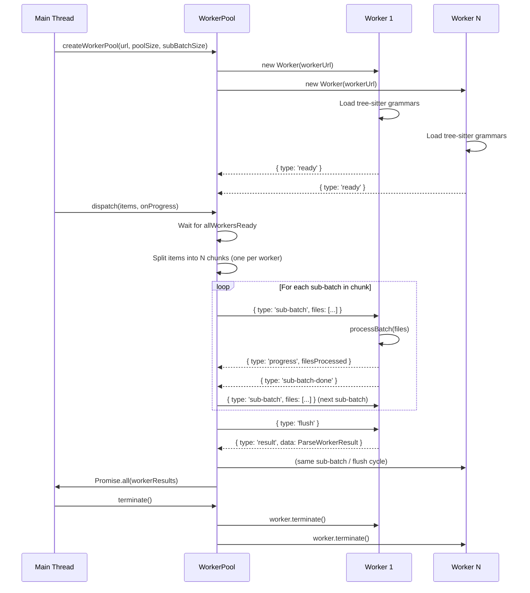
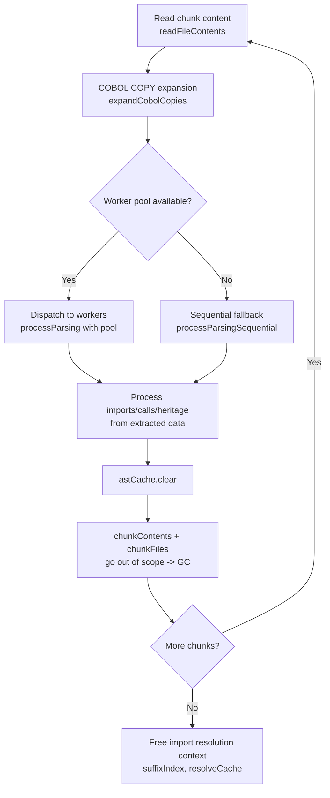
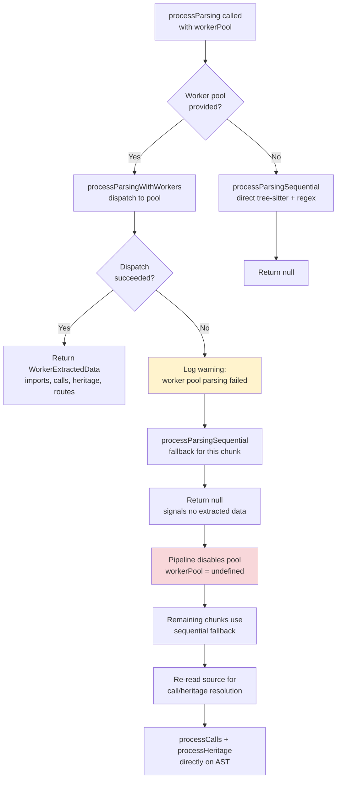

# Worker Architecture: Parallel Code Parsing

GitNexus uses a pool of Node.js `worker_threads` to parse source files in parallel during the indexing pipeline. This document describes the worker lifecycle, sub-batching protocol, memory management, timeout handling, and error recovery.

**Source files:**

- [`gitnexus/src/core/ingestion/workers/worker-pool.ts`](/gitnexus/src/core/ingestion/workers/worker-pool.ts) -- pool creation, dispatch, sub-batch orchestration
- [`gitnexus/src/core/ingestion/workers/parse-worker.ts`](/gitnexus/src/core/ingestion/workers/parse-worker.ts) -- per-worker parsing logic, message handler
- [`gitnexus/src/core/ingestion/pipeline.ts`](/gitnexus/src/core/ingestion/pipeline.ts) -- pipeline orchestration, chunk budgeting, pool lifecycle
- [`gitnexus/src/core/ingestion/parsing-processor.ts`](/gitnexus/src/core/ingestion/parsing-processor.ts) -- worker dispatch, sequential fallback, result merging

---

## Worker Lifecycle

The main thread creates a `WorkerPool` of N workers, where N = `min(8, max(1, os.cpus().length - 1))`. Each worker loads tree-sitter grammars at module init time, then enters a message loop that processes sub-batches of files and accumulates results until flushed.



### Message Protocol

| Direction | Message | Description |
|-----------|---------|-------------|
| Worker -> Pool | `{ type: 'ready' }` | Worker finished loading grammars; ready for work |
| Pool -> Worker | `{ type: 'sub-batch', files: [...] }` | Batch of files to parse |
| Worker -> Pool | `{ type: 'progress', filesProcessed }` | Periodic progress update (cumulative across sub-batches) |
| Worker -> Pool | `{ type: 'sub-batch-done' }` | Sub-batch complete; send next or flush |
| Pool -> Worker | `{ type: 'flush' }` | No more sub-batches; send accumulated results |
| Worker -> Pool | `{ type: 'result', data: ParseWorkerResult }` | All accumulated nodes, relationships, symbols, imports, calls, heritage, routes |
| Worker -> Pool | `{ type: 'error', error: string }` | Unrecoverable error in worker |
| Worker -> Pool | `{ type: 'warning', message }` | Non-fatal warning (e.g., query compilation failure) |

---

## Sub-Batching Mechanism

Rather than sending an entire chunk to a worker in one `postMessage`, the pool slices each chunk into sub-batches. This bounds the peak memory consumed by structured-clone serialization per message.

| Parameter | Default | COBOL Mode | Source |
|-----------|---------|------------|--------|
| `DEFAULT_SUB_BATCH_SIZE` | 1500 files | 200 files | `worker-pool.ts:26` |
| Configured via | `createWorkerPool(url, poolSize, subBatchSize)` | `pipeline.ts:384` auto-detects | |

**Why 200 for COBOL:** COBOL files go through regex extraction + COPY preprocessing, which takes approximately 150ms per file compared to approximately 5ms for tree-sitter-parsed languages. A sub-batch of 1500 COBOL files would take approximately 225s, well beyond the 120s timeout. At 200 files, each sub-batch completes in approximately 30s.

The sub-batch flow within a single worker:

1. Pool sends `{ type: 'sub-batch', files: [...] }` with up to `effectiveSubBatchSize` files.
2. Worker calls `processBatch()`, emitting `{ type: 'progress' }` periodically.
3. Worker merges the sub-batch result into `accumulated` (a module-level `ParseWorkerResult`).
4. Worker sends `{ type: 'sub-batch-done' }`.
5. Pool sends the next sub-batch, or `{ type: 'flush' }` if no files remain.
6. On flush, the worker sends `{ type: 'result', data: accumulated }` with all data from every sub-batch.

---

## Worker Pool Sizing

```
Pool size = min(8, max(1, os.cpus().length - 1))
```

- On a 4-core machine: 3 workers
- On a 16-core machine: 8 workers (capped)
- On a single-core machine: 1 worker

Items dispatched to the pool are split into equal-sized chunks (one per worker). Each worker processes its chunk sequentially through sub-batches. Progress callbacks are aggregated across all workers:

```typescript
// worker-pool.ts:93-94
const workerProgress = new Array(chunks.length).fill(0);
// ...
const total = workerProgress.reduce((a, b) => a + b, 0);
onProgress(total);
```

There is currently no CLI option to override the pool size; it is always auto-detected.

---

## Memory Management

### Chunk Byte Budget

The pipeline groups parseable files into chunks of at most 20MB of source content before dispatching to the worker pool.

```
CHUNK_BYTE_BUDGET = 20 * 1024 * 1024  // 20MB source
```

This 20MB of source translates to approximately 200--400MB of peak working memory per chunk after:

- AST construction (tree-sitter parse trees)
- Extracted records (nodes, relationships, symbols, imports, calls, heritage, routes)
- Structured-clone serialization overhead for `postMessage`

### Memory Lifecycle Per Chunk



### Key Memory Controls

| Control | Value | Location |
|---------|-------|----------|
| Chunk budget | 20MB source content | `pipeline.ts:37` (`CHUNK_BYTE_BUDGET`) |
| AST cache | LRU, sized to max chunk file count | `pipeline.ts:396-397` |
| Import resolution context | Built once, reused across all chunks | `pipeline.ts:401` |
| Between chunks | `astCache.clear()`, chunk variables go out of scope | `pipeline.ts:519-520` |
| After all chunks | `importCtx.resolveCache.clear()`, suffix index nulled | `pipeline.ts:543-545` |

The AST cache is re-created per pipeline run with capacity equal to the largest chunk's file count (`pipeline.ts:397`). The import resolution context (suffix index, file list, resolve cache) is built once from all paths and reused across chunks to avoid rebuilding `O(files x path_depth)` structures per chunk.

---

## Timeout Handling

### Sub-Batch Timeout

Each sub-batch has a timeout to catch pathological files (e.g., minified 50MB JavaScript, COBOL with complex external scanner behavior).

| Parameter | Default | Env Override |
|-----------|---------|--------------|
| `SUB_BATCH_TIMEOUT_MS` | 120,000 ms (2 minutes) | `GITNEXUS_WORKER_TIMEOUT_MS` |

When triggered:

1. The timer fires inside `dispatch`.
2. The worker is terminated via `worker.terminate()`.
3. The dispatch promise rejects with: `Worker N sub-batch timed out after 120s (chunk: M items).`
4. The error propagates to `processParsingWithWorkers`, which catches it and triggers sequential fallback.

### Worker Startup Timeout

Workers must signal readiness (`{ type: 'ready' }`) within a configurable window. This covers the time to load tree-sitter and all language grammars (12+ native modules).

| Parameter | Default | Env Override |
|-----------|---------|--------------|
| `WORKER_STARTUP_TIMEOUT_MS` | 60,000 ms (1 minute) | `GITNEXUS_WORKER_STARTUP_TIMEOUT_MS` |

When triggered:

1. `Promise.race` between `allWorkersReady` and the timeout rejects.
2. All subsequent `dispatch` calls reject immediately.
3. The pool is terminated and sequential fallback is used.

---

## Error Recovery



### Failure Modes

| Failure | Detection | Recovery |
|---------|-----------|----------|
| Worker crash (OOM, native addon failure) | `exit` event with non-zero code | Pool terminated, sequential fallback for all remaining chunks |
| Sub-batch timeout | Timer fires after `SUB_BATCH_TIMEOUT_MS` | Worker terminated, dispatch rejects, sequential fallback |
| Startup timeout | All workers fail to send `ready` within `WORKER_STARTUP_TIMEOUT_MS` | Dispatch rejects, sequential fallback |
| Worker script not found | `fs.existsSync` check at pool creation | `createWorkerPool` throws, pipeline catches and uses sequential |
| Parse error on single file | `try/catch` inside `processBatch` per file | File skipped, other files in batch continue |

### COBOL-Only Repos

When `GITNEXUS_COBOL_DIRS` is set, workers skip tree-sitter loading entirely (lazy loading). This avoids loading 12+ native modules that are unnecessary for regex-only COBOL extraction:

```typescript
// parse-worker.ts:29
const isCobolOnlyMode = !!process.env.GITNEXUS_COBOL_DIRS;

// parse-worker.ts:82-84
if (!isCobolOnlyMode) {
  ensureTreeSitterLoaded();
}
```

Tree-sitter is loaded on-demand only if a non-COBOL file is encountered during batch processing.

---

## Data Flow: ParseWorkerResult

Each worker accumulates results across all its sub-batches and sends them in a single `{ type: 'result', data }` message on flush. The result structure:

```typescript
interface ParseWorkerResult {
  nodes: ParsedNode[];           // Graph nodes to add
  relationships: ParsedRelationship[];  // Graph edges to add
  symbols: ParsedSymbol[];       // Symbol table entries
  imports: ExtractedImport[];    // Raw import statements for resolution
  calls: ExtractedCall[];        // Call sites for cross-file resolution
  heritage: ExtractedHeritage[]; // Inheritance/implementation relationships
  routes: ExtractedRoute[];      // HTTP route definitions (Laravel, etc.)
  fileCount: number;             // Total files processed across sub-batches
}
```

### Record Types

**ParsedNode** -- a graph node (function, class, method, etc.):

| Field | Type | Description |
|-------|------|-------------|
| `id` | `string` | Deterministic ID: `generateId(label, filePath:name)` |
| `label` | `string` | Node type: Function, Class, Method, Module, Interface, etc. |
| `properties.name` | `string` | Symbol name |
| `properties.filePath` | `string` | Absolute file path |
| `properties.startLine` | `number` | Start line (0-indexed) |
| `properties.endLine` | `number` | End line (0-indexed) |
| `properties.language` | `SupportedLanguages` | Source language |
| `properties.isExported` | `boolean` | Whether the symbol is exported |

**ParsedRelationship** -- a graph edge:

| Field | Type | Description |
|-------|------|-------------|
| `id` | `string` | Deterministic edge ID |
| `sourceId` | `string` | Source node ID |
| `targetId` | `string` | Target node ID |
| `type` | `string` | Edge type: DEFINES, CALLS, IMPORTS, HAS_METHOD, etc. |
| `confidence` | `number` | Resolution confidence (0.0--1.0) |
| `reason` | `string` | Why this edge was created |

**ParsedSymbol** -- symbol table entry for cross-file resolution:

| Field | Type | Description |
|-------|------|-------------|
| `filePath` | `string` | File containing the symbol |
| `name` | `string` | Symbol name |
| `nodeId` | `string` | Corresponding graph node ID |
| `type` | `string` | Symbol type (Function, Class, etc.) |
| `parameterCount` | `number?` | Parameter count (for disambiguation) |
| `ownerId` | `string?` | Enclosing class ID (for methods) |

**ExtractedImport** -- raw import for post-worker resolution:

| Field | Type | Description |
|-------|------|-------------|
| `filePath` | `string` | File containing the import |
| `rawImportPath` | `string` | Import specifier as written in source |
| `language` | `SupportedLanguages` | Source language |
| `namedBindings` | `Array?` | Named bindings (e.g., `{local, exported}`) |

**ExtractedCall** -- call site for cross-file resolution:

| Field | Type | Description |
|-------|------|-------------|
| `filePath` | `string` | File containing the call |
| `calledName` | `string` | Name of the called function/method |
| `sourceId` | `string` | ID of enclosing function (or File node for top-level) |
| `callForm` | `string?` | `'free'`, `'member'`, or `'constructor'` |
| `receiverName` | `string?` | Receiver identifier (e.g., `user` in `user.save()`) |
| `argCount` | `number?` | Number of arguments at call site |

**ExtractedHeritage** -- inheritance/implementation:

| Field | Type | Description |
|-------|------|-------------|
| `filePath` | `string` | File containing the class |
| `className` | `string` | Child class name |
| `parentName` | `string` | Parent class/interface name |
| `kind` | `string` | `'extends'`, `'implements'`, `'trait-impl'`, `'include'`, `'extend'`, `'prepend'` |

**ExtractedRoute** -- HTTP route definition:

| Field | Type | Description |
|-------|------|-------------|
| `filePath` | `string` | Route file path |
| `httpMethod` | `string` | HTTP method (GET, POST, etc.) |
| `routePath` | `string?` | URL path pattern |
| `controllerName` | `string?` | Controller class name |
| `methodName` | `string?` | Handler method name |
| `middleware` | `string[]` | Applied middleware |
| `prefix` | `string?` | Route prefix |
| `lineNumber` | `number` | Line number in source |

---

### Post-Worker Resolution

After workers return extracted data, the main thread resolves cross-file relationships using the full symbol table and import map:

1. **Imports** -- `processImportsFromExtracted` resolves `rawImportPath` to actual file nodes using the import resolution context (suffix index, package.json maps).
2. **Calls** -- `processCallsFromExtracted` matches `calledName` + `callForm` + `receiverName` against the symbol table to create CALLS edges.
3. **Heritage** -- `processHeritageFromExtracted` resolves `parentName` to class/interface nodes to create EXTENDS/IMPLEMENTS edges.
4. **Routes** -- `processRoutesFromExtracted` matches `controllerName` + `methodName` to symbol table entries.

These four resolution steps run in parallel (calls, heritage, and routes write disjoint relationship types into idempotent id-keyed Maps):

```typescript
// pipeline.ts:482-505
await Promise.all([
  processCallsFromExtracted(...),
  processHeritageFromExtracted(...),
  processRoutesFromExtracted(...),
]);
```

---

[Back to README](../../README.md)
